### mar30 
- `shift + right` click to open menu to select terminal  
- environmental variables , from bin folder 
- in eclipse `ctrl+alt+T` opens a terminal


### apr13
-  Why can’t you declare a method inside main() in Java?
    - Java is a statically-typed, block-structured, class-based language.
    - Methods are members of a class — not of other methods.
    - A method definition must exist at the class level, not nested inside another method. 

            void sayHello() {
                System.out.println("Hello!");
            }

    - defining a method.👆
    - But in Java:   
      You can call methods inside methods.  
     ` You cannot declare methods inside methods — because Java's syntax and memory model are not designed to handle nested method scopes.`

     - if you try it, u would get `error: illegal start of expression`
- Why?  
    - Because the Java compiler only expects statements (like int x = 5;, sayHello();, if(...) {...} etc.) inside a method.  
    - A method definition is not a statement — it belongs to the class body, not inside a method body.

    -correct apporoach  
     
        public class Main {
            public static void main(String[] args) {
                sayHello();
            }

            static void sayHello() {
                System.out.println("Hello!");
            }
        }

- 
    What you wanted	Java equivalent   
    Method inside main--------------------- ❌ Not allowed  
    Anonymous class inside main------------ ✅ Yes  
    Lambda inside main (Java 8+)----------- ✅ Yes
---
- ⚙️ But other languages allow this…  
    Yes!  
    Languages like Python and JavaScript allow function definitions inside functions because:  

    Their runtime environments are more dynamic.  

    Functions are first-class citizens (they can be created, passed, and returned like any other value).

    Their scoping and memory models are built to support this.
    
    📝  

        def main():
            def say_hello():
                print("Hello!")
            say_hello()
        
        main()
---


### ⚡apr14

✅ What is Method Overloading?  
Method Overloading ek aisa feature hai jisme ek hi naam ke multiple methods banaye jaate hain, lekin:  

- Unke parameters ka number alag hota hai

- Ya parameters ka type alag hota hai

- Ya dono alag hote hain  

   → Same method name, different method signatures.  
---

✅ Rules of Method Overloading
Method ka naam same hoga

- Parameters alag honge

- Number of parameters alag

- Ya type alag

- Ya dono alag

- Return type ka koi lena dena nahi hota    

📌 Return type change karne se method overloading nahi hoti
Agar sirf return type badla, to error aayega  

- Java compile time pe decide karta hai ki kaunsa method call hoga — isliye isse Compile-time Polymorphism bhi bolte hain.

---

✅ Practical Real-World Use Cases  
Situation -----------------------------Method Overloading Example  
Calculator app----------------------- add(int, int), add(double, double), add(int, int, int)  
Logging or Message formatting-----log(String msg), log(String msg, int errorCode)    
Banking application------------------(withdraw)	withdraw(int amount), withdraw(double amount)  
Drawing shapes----------------------draw(int radius), draw(int length, int breadth)  
File saving ---------------------------save(String path), save(String path, boolean overwrite)  

---


### ⚡apr20

#### I encounter some issue in running the access modifier code, have a proper folder structure for packages and make sure to complie eveything using wildcard.  
- ` javac building1\*.java building2\*.java`
    - declare package building1;
    - declare package building2;
    - then complie eveything , in order to work properly


---
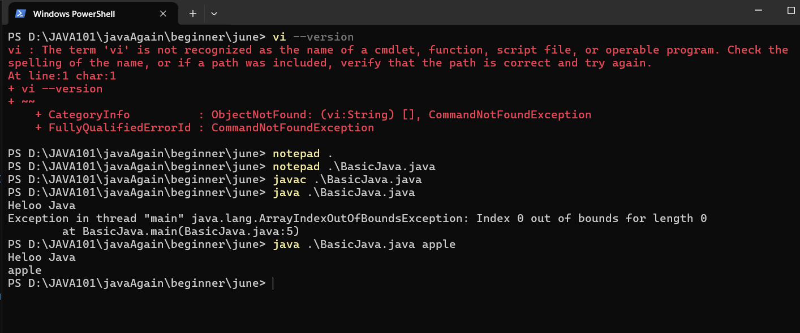

---
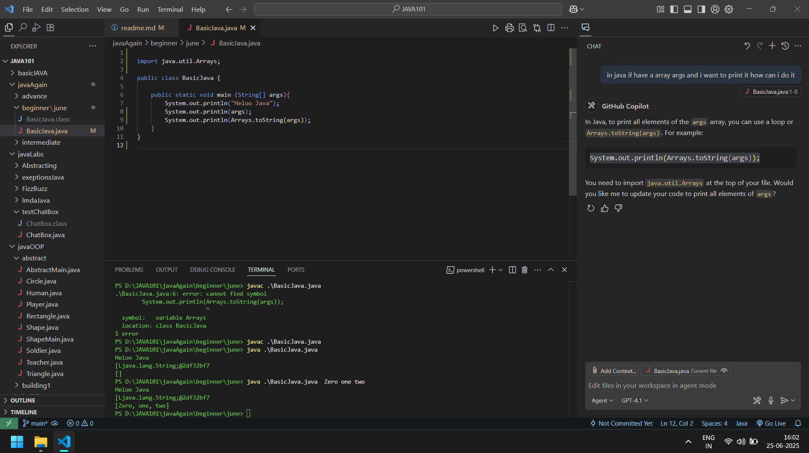

---
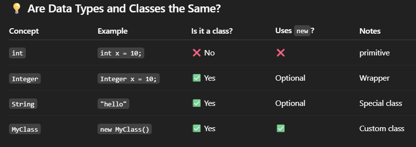

---
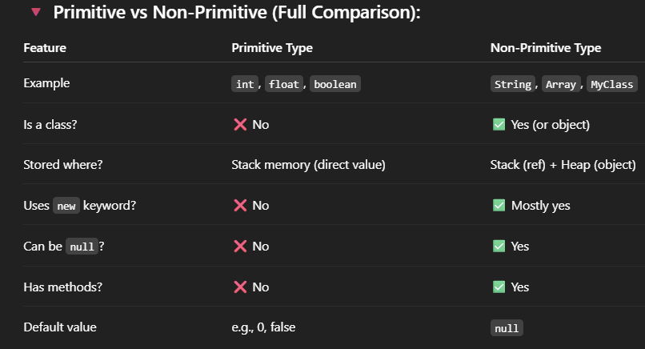

---
### After learning md , now observe the note quality
--- 

# ⚡Static Class,still object making , java depth🔥 
<details>

```java
    package basicConcepts;

    public class StringDatatype {   

    // Nested class Pupil inside StringDatatype
    static class Pupil {
        String name;
        int std;
        String result;

        // Constructor
        Pupil(String name, int std, String result) {
            this.name = name;
            this.std = std;
            this.result = result;
        }
    }

     public static void main(String[] args) {
        // Create an object of Pupil
        Pupil p1 = new Pupil("Prakash", 10, "Pass");
        
        // Print details
        System.out.println("Name: " + p1.name);
        System.out.println("Standard: " + p1.std);
        System.out.println("Result: " + p1.result);
    }
}

```
1. 
---

<div align="center">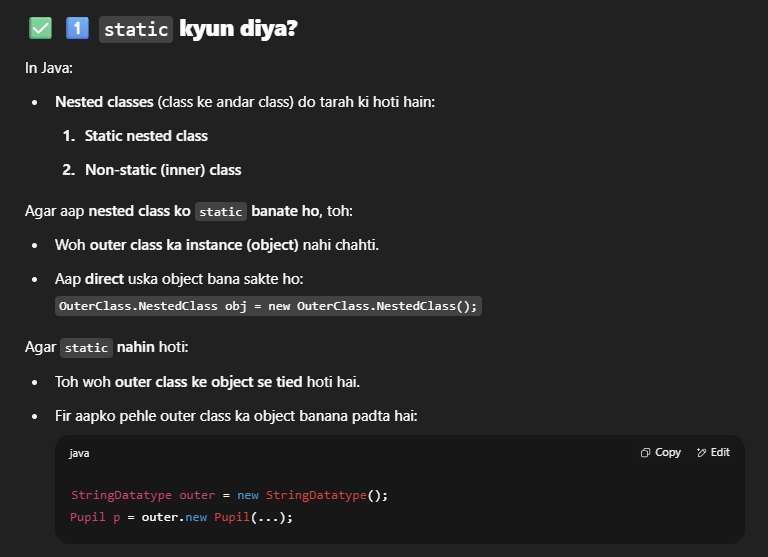</div>

2. 
---

<div align="center">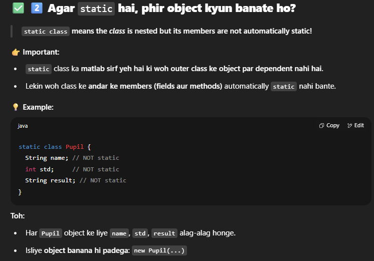</div>

3.   
---

<div align="center">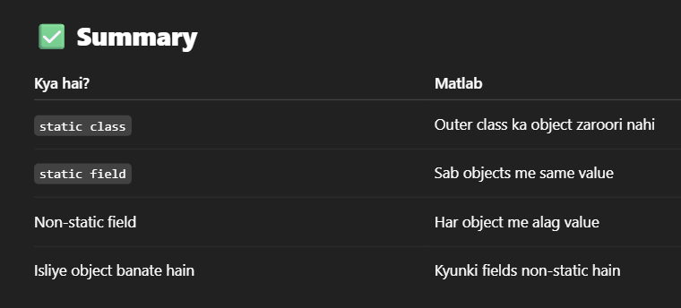</div>

### More on Static
✅ static hota kya hai? - 
“Yeh cheez class ke saath judi hai, object ke saath nahi.”

🔵 1️⃣ Jab koi cheez static hoti hai:

- Usko class name se hi access kar sakte ho.

- Object banane ki zarurat nahi hoti.(variables and method ke case mei)
- But agr class Static hai , eska mtlb obivously vo kis top class ke ander hogi , isley 
    - outer object tou banana hi padyga top class ka.

observe
```java
class A {
  static int num = 10;    // static field
  static void show() {    // static method
    System.out.println("Hello");
  }
}

// Access:
A.num;         // ✅
A.show();      // ✅

A a = new A();
a.show();      // ❌ bad practice, but works

```

---
🔵 2️⃣ Agar static nahi hai:  
- Toh woh instance (object) se related hai.

- Usko access karne ke liye object banana zaruri hai.

Example:
```java
class A {
  int num = 5;           // instance field
  void show() {          // instance method
    System.out.println("Hi");
  }
}

// Access:
A.show();   // ❌ Error

A a = new A();
a.show();   // ✅ Works

```
---
<br>
<br>
<div align="center">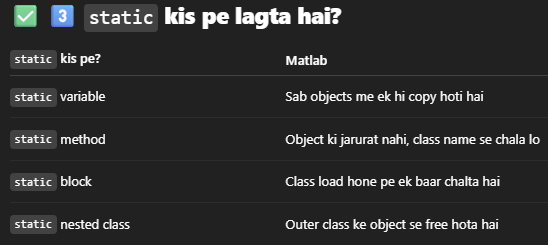</div>

4. 
example:
<details><summary>full demo</summary>

```java

    class Example {
    static int count = 0; // static variable

    int id;               // instance variable

    Example(int id) {
        this.id = id;
        count++;            // static value sab objects me same
    }

    static void staticMethod() {
        System.out.println("Static method");
    }

    void instanceMethod() {
        System.out.println("Instance method");
    }

    static class Nested {
        void show() {
        System.out.println("Static nested class");
        }
    }
    }

    public class Main {
    public static void main(String[] args) {
        Example.staticMethod();         // ✅

        Example e1 = new Example(101);
        Example e2 = new Example(102);

        System.out.println(Example.count); // ✅

        Example.Nested n = new Example.Nested();
        n.show();                        // ✅
    }
    }

```
</details>

<div align="center">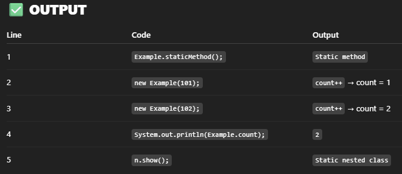</div>
<div align="center">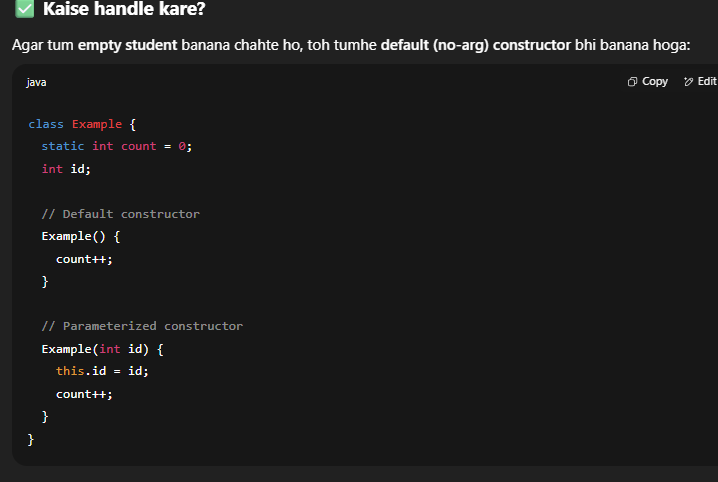</div>

## moreStatic again  

✅ 1️⃣ static ka matlab kya?
static ka matlab:

- Yeh cheez class ke sath jud gayi, object ke sath nahi.

- Jab koi cheez static hoti hai, toh uske liye har object me alag copy nahi banegi, bas ek hi copy hogi jo class ke level par hoti hai.

✅ 2️⃣ static ka fayda kya hai?  
- Agar tumhe aise data ya method chahiye jo sab objects me same ho, toh static banao.

- Isse memory save hoti hai, aur common info ko maintain karna easy ho jata hai.

✅ 3️⃣ Real example
🔹 Example: College Students   
Socho tum ek College bana rahe ho:  

- Har student ka naam, roll number alag hoga → object level data.

- Sab students ka College name same hoga → class level data.

<div align="center">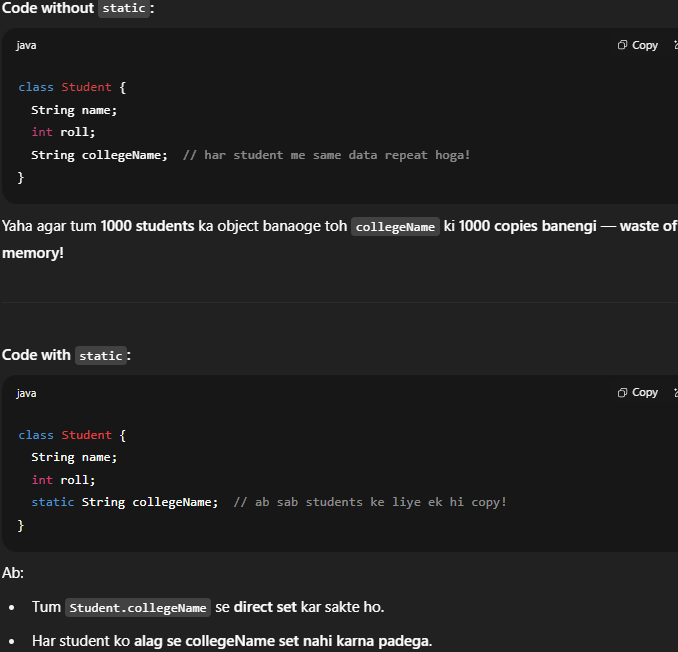</div>

---
5. 
<br> 

```java
Student.collegeName = "XYZ College";

Student s1 = new Student();
s1.name = "Ram";
s1.roll = 1;

Student s2 = new Student();
s2.name = "Shyam";
s2.roll = 2;

System.out.println(s1.collegeName);  // XYZ College
System.out.println(s2.collegeName);  // XYZ College

```


6. 
✅ Phir s1.collegeName allowed kyun hai?  
- Java ko tumhe flexibility deni hoti hai, isliye woh syntax allow karti hai.

- Lekin yeh good practice nahi hai, kyunki:    

   - collegeName object se related nahi hai, woh sab objects me common hai.

   - Tumhe clearly dikhana chahiye ki yeh variable class level ka hai, object level ka nahi.

7. 
✅ Real warning
Agar tum s1.collegeName likhoge, toh beginners ko lag sakta hai ki:  
>"Oh! Shayad har object ka collegeName alag hai!"   
But woh galat hoga — sabka collegeName same hai.

```java
System.out.println(Student.collegeName); ✅ Clear
System.out.println(s1.collegeName); ❌ Confusing but works

```
8. 
✅ Ek twist
Agar tum s1.collegeName = "ABC"; likh doge:  
- Toh Java collegeName ki value class level pe hi change karega.  
- s2.collegeName bhi ABC ho jayega.
- Toh s1.collegeName se change karna allowed hai, lekin woh change sab pe apply hoga.

---

9. 
<details><summary>Real world Example</summary>

```java
class BankAccount {
    String accountHolder;
    double balance;
    static double interestRate = 5.0;  // same for all accounts

    BankAccount(String accountHolder, double balance) {
        this.accountHolder = accountHolder;
        this.balance = balance;
    }

    void displayAccountInfo() {
        System.out.println("Account Holder: " + accountHolder);
        System.out.println("Balance: " + balance);
        System.out.println("Interest Rate: " + interestRate + "%");
    }

    static void changeInterestRate(double newRate) {
        interestRate = newRate;
    }
}

public class Main {
    public static void main(String[] args) {
        BankAccount acc1 = new BankAccount("Ram", 10000);
        BankAccount acc2 = new BankAccount("Shyam", 20000);

        acc1.displayAccountInfo();
        acc2.displayAccountInfo();

        // Bank changes interest rate for everyone
        BankAccount.changeInterestRate(6.5);

        System.out.println("\nAfter changing interest rate:\n");

        acc1.displayAccountInfo();
        acc2.displayAccountInfo();
    }
}

Account Holder: Ram
Balance: 10000.0
Interest Rate: 5.0%

Account Holder: Shyam
Balance: 20000.0
Interest Rate: 5.0%

After changing interest rate:

Account Holder: Ram
Balance: 10000.0
Interest Rate: 6.5%

Account Holder: Shyam
Balance: 20000.0
Interest Rate: 6.5%


```
</details>

---
10. Static Continued
<details>

-  static word sunke lagta hai fixed, rukaa hua, badalne nahi wala — par Java mein woh badal bhi sakta hai!Toh iska naam static kyun hai? Chalo clear karte hain 👇

✅ 1️⃣ Static word ka asal matlab  
Java mein static ka matlab “class ke saath fixed” hota hai — object ke saath nahi.    

- static ka matlab “class level par fix ho gaya” — iska koi object ke saath link nahi hai.

- Isliye:

    - Har object alag se copy nahi banayega.

    - Ek hi copy sab share karenge.

    - Isliye memory static hoti hai — woh class loading time pe reserve ho jati hai.
    - `meomry address is constan tbut value can be changed.`

✅ 2️⃣ Static ka real meaning: “memory location fixed”
Socho:  
- Jab class load hoti hai (class Student), tab hi static cheez ke liye memory reserve ho jati hai.

- Jab tak class loaded hai, woh value available hai — bina kisi object ke.

- Isliye static ka matlab: class ke sath fix, runtime me fixed, par value change ho sakti hai.

```java 

```
</details>


---
11. 
<details>

```java
class User {
    static int totalUsers = 0; // Class load pe ek baar hi 0 hoga

    String name;

    User(String name) {
        this.name = name;
        totalUsers++;  // Har object banne pe badhega
        System.out.println("New user created: " + name);
        System.out.println("Current total users: " + totalUsers);
    }
}

public class Main {
    public static void main(String[] args) {
        System.out.println("Starting program...");

        System.out.println("Current total users BEFORE any user: " + User.totalUsers);

        User u1 = new User("Ram");
        User u2 = new User("Shyam");
        User u3 = new User("Mohan");

        System.out.println("Current total users AFTER all users: " + User.totalUsers);
    }
}
```
</details>
---

12.  
<details>
🔍 Tera point kya hai?
Tu keh raha hai:

>Agar User class mein static int totalUsers = 0; hai
aur User u1 = new User(); likha,
toh kya totalUsers dobara 0 nahi ho jana chahiye?

Matlab:  
- Har new User() pe class dubara chalegi kya?  
- Kya static int totalUsers = 0; har object ke saath fir se execute hoga?

✅ Jawab: Bilkul nahi hoga!  
Java mein class ek hi baar load hoti hai — JVM ke andar!  
- Jab tumhara User class pehli baar use hota hai (chahe new se ya static member access se), tab JVM:  

    - static int totalUsers = 0; ek hi baar run karta hai.  
    - totalUsers ke liye memory reserve ho jaati hai → Method Area mein.  

- Uske baad jitni baar bhi new User() likhoge:  
    - Bas constructor run hota hai, static part dobara nahi.  
</details>  

---

13. Stick with hyphens (-) as you are already using them. They are more SEO-friendly and widely used in web projects.
---

14. ### 👉Now observe that how the Syntax for making the instance/object changes in case of a nested static class.
---

>I hope till now we have under stood that "why static" 
> - static class se related hota hai , object se nahi 
> - static members ko bina object banaye, sirf class naam se access kar sakte ho.
> - static member ki memory fixed hoti hai value nahi , we change its value again and again.
> - static(fixed) yet flexible.

**♦️🚩Now here is the catch**  
 - even though static members ke leye object nahi banane hoty ,but 
 - if a class is nested and also it is static , in that case in order to use that static-class we have to make an object of outer/top class 
 
**`Top-level classes (the ones you write directly in a .java file) — can’t be static. they are always "public class AnyName" `**

```java
// ✅ Valid: Top-level
public class Outer {
    static class StaticInner { }  // OK
    class Inner { }               // Also OK
}

// ❌ Invalid: Top-level
static class Standalone { } // Compile error!

```

🔥See here 
- a class can have a another class inside it (nested)
    - a non static
    - a static

####  bhai saaf saaf baat hai, whether the inner class is static or non static , dono case mei outer/top class ka instance/object banyga 

<!--   -->
<!-- 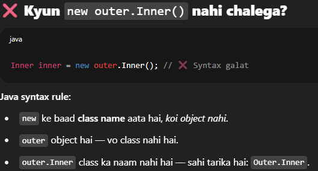 -->
<!-- 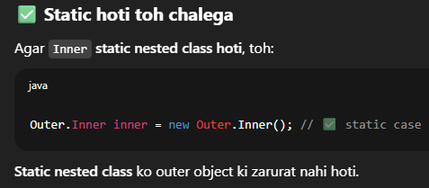 -->


👉 Java ka rule hai:

>Non-static inner class ka object kabhi bhi independent nahi ban sakta.  
Uske paas Outer ka instance hona chahiye.


♦️Click to see a detailed exampleand guide
<details>

```java
public class Company {
    String companyName = "TechCorp";

    // Static Nested Class
    static class Department {
        String deptName;

        Department(String deptName) {
            this.deptName = deptName;
        }

        void showDept() {
            System.out.println("Department Name: " + deptName);
        }
    }

    // Non-Static Inner Class
    class Employee {
        String empName;

        Employee(String empName) {
            this.empName = empName;
        }


        void showEmployee() {
            System.out.println("Employee Name: " + empName);
            System.out.println("Works at: " + companyName);
        }
    }

    public static void main(String[] args) {
        System.out.println("=== Static Nested Classes ===");

        // ✅ Create multiple Departments
        Company.Department dept1 = new Company.Department("Engineering");
        Company.Department dept2 = new Company.Department("Marketing");

        dept1.showDept();
        dept2.showDept();

        System.out.println("\n=== Non-Static Inner Classes ===");

        // ✅ Create 1 Company instance
        Company myCompany = new Company();

        // ✅ Create multiple Employees under same Company
        Company.Employee emp1 = myCompany.new Employee("Prakash");
        Company.Employee emp2 = myCompany.new Employee("Sara");
        Company.Employee emp3 = myCompany.new Employee("Ravi");

        emp1.showEmployee();
        emp2.showEmployee();
        emp3.showEmployee();
    }
}

//output 

=== Static Nested Classes ===
Department Name: Engineering
Department Name: Marketing

=== Non-Static Inner Classes ===
Employee Name: Prakash
Works at: TechCorp
Employee Name: Sara
Works at: TechCorp
Employee Name: Ravi
Works at: TechCorp
```

✔️ 1️⃣ Static Nested Classes — multiple Departments  
- dept1 and dept2 don’t need any Company object.  
- They’re completely separate.  
- Example: Multiple Departments can exist even without creating a Company instance.

✔️ 2️⃣ Non-Static Inner Classes — multiple Employees  
- Only one Company object (myCompany) is created.  
- All Employee objects are tied to that one Company instance.  
- So all Employee objects can access companyName. 

---
emp mei constructor ke through dept ko send karo 
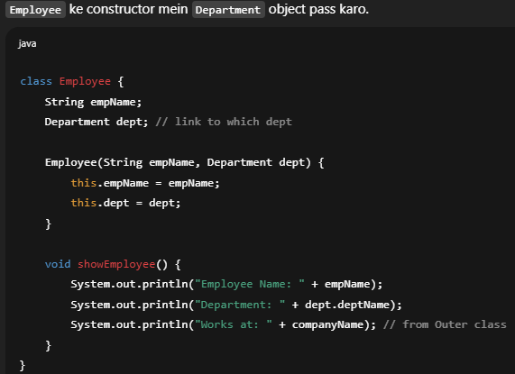

```java
public class Company {
    String companyName = "TechCorp";

    // Static Nested Class
    static class Department {
        String deptName;

        Department(String deptName) {
            this.deptName = deptName;
        }

        void showDept() {
            System.out.println("Department Name: " + deptName);
        }
    }

    // Non-Static Inner Class
    class Employee {
        String empName;
        Department dept;  // link to department

        Employee(String empName, Department dept) {
            this.empName = empName;
            this.dept = dept;
        }

        void showEmployee() {
            System.out.println("Employee Name: " + empName);
            System.out.println("Department: " + dept.deptName);
            System.out.println("Works at: " + companyName);
        }
    }

    public static void main(String[] args) {
        // Static nested class objects — Departments
        Department eng = new Department("Engineering");
        Department mkt = new Department("Marketing");

        eng.showDept();
        mkt.showDept();

        // Non-static inner class objects — Employees
        Company myCompany = new Company();

        Company.Employee emp1 = myCompany.new Employee("Prakash", eng);
        Company.Employee emp2 = myCompany.new Employee("Sara", mkt);
        Company.Employee emp3 = myCompany.new Employee("Ravi", eng);

        emp1.showEmployee();
        emp2.showEmployee();
        emp3.showEmployee();
    }
}
```


</details>

</details>
<br>

# 🔥Method Chaining 🔗🔗🔗

This design or way of writing a function is helpful when you are making a object with lot of parametrs and they can get confusing .Also in the process u might miss the sequence of passing a parameter, and may encounter a error.

Method Chaining is most evident in Builer pattern/method.

<details><summary>Click 4 moreDetails</summary>

### 1. Three Versions 
    
1. Constructor-only
    - sari values object banaty time hi deni hoti hai , correct sequence mei
    - code mei setMethods nahi hai , no return values
    - method-chaining nahi hogi ❌❌

```java
public class Player {
    private String name;
    private int age;
    private String gender;
    private String weapon;
    private String unit;
    private String service;
    private int score;

    // Constructor Only
    public Player(String name, int age, String gender, String weapon, String unit, String service, int score) {
        this.name = name;
        this.age = age;
        this.gender = gender;
        this.weapon = weapon;
        this.unit = unit;
        this.service = service;
        this.score = score;
    }

    public void printSummary() {
        System.out.println("Player: " + name + " (" + gender + ", " + age + ")");
        System.out.println("Unit: " + unit + ", Service: " + service);
        System.out.println("Weapon: " + weapon + ", Score: " + score);
    }
}

Player p = new Player("Praka",29,"male"...)
```

2. Method-Chainig (No explicit construcutr written)
```java
public class Player {
    private String name;
    private int age;
    private String gender;
    private String weapon;
    private String unit;
    private String service;
    private int score;

    // Default constructor
    public Player() {}

    public Player setName(String name) {
        this.name = name;
        return this;
    }

    public Player setAge(int age) {
        this.age = age;
        return this;
    }

    public Player setGender(String gender) {
        this.gender = gender;
        return this;
    }

    public Player setWeapon(String weapon) {
        this.weapon = weapon;
        return this;
    }

    public Player setUnit(String unit) {
        this.unit = unit;
        return this;
    }

    public Player setService(String service) {
        this.service = service;
        return this;
    }

    public Player setScore(int score) {
        this.score = score;
        return this;
    }

    public Player printSummary() {
        System.out.println("Player: " + name + " (" + gender + ", " + age + ")");
        System.out.println("Unit: " + unit + ", Service: " + service);
        System.out.println("Weapon: " + weapon + ", Score: " + score);
        return this;
    }
}

new Player()
    .setName("Arjun")
    .setAge(25)
    .setGender("Male")
    .setWeapon("Sniper")
    .setUnit("Alpha")
    .setService("Stealth Ops")
    .setScore(8700)
    .printSummary();
```
3. Constructor + MethodChaining(Best of both)
```java
public class Player {
    private String name;
    private int age;
    private String gender;
    private String weapon;
    private String unit;
    private String service;
    private int score;

    // Full constructor
    public Player(String name, int age, String gender, String weapon, String unit, String service, int score) {
        this.name = name;
        this.age = age;
        this.gender = gender;
        this.weapon = weapon;
        this.unit = unit;
        this.service = service;
        this.score = score;
    }

    // Default constructor (for chaining)
    public Player() {}

    public Player setName(String name) {
        this.name = name;
        return this;
    }

    public Player setAge(int age) {
        this.age = age;
        return this;
    }

    public Player setGender(String gender) {
        this.gender = gender;
        return this;
    }

    public Player setWeapon(String weapon) {
        this.weapon = weapon;
        return this;
    }

    public Player setUnit(String unit) {
        this.unit = unit;
        return this;
    }

    public Player setService(String service) {
        this.service = service;
        return this;
    }

    public Player setScore(int score) {
        this.score = score;
        return this;
    }

    public Player printSummary() {
        System.out.println("Player: " + name + " (" + gender + ", " + age + ")");
        System.out.println("Unit: " + unit + ", Service: " + service);
        System.out.println("Weapon: " + weapon + ", Score: " + score);
        return this;
    }
}

//now an instance can be createdd using either of the methods.
```
<br>
<br>
<br>

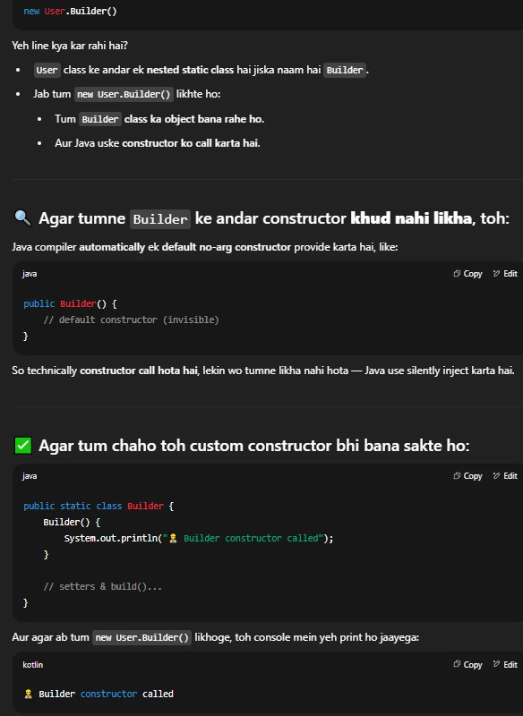

</details>

<br> 
<br> 

# ⚡Core of Java 
<details>

in java   
- classes are like datatype.Blueprint to make items/objects/instances.
- Suppose u have different students who have there own individual name,branch,sem.  
    - at the same time all students of a particular college will have same Collegename and Principal name 

- so make a tamplate called Student which can process/keep student parameters using constructor. Also based on the paramemters provided it can perform function(method) on it and return u a result.
- where as this template can have certian fixed value of its own which is constant(yet) changable through out.(static)
- so the data Members which are different for each memebers are called INSTANCE LEVEL VARIABLES/METHODS.
- and datamembers which are fixed in the template are called CLASS LEVEL MEMBERS. and they are called by using the class reference  `class.datamember` -->Student.Principal 
    - Student is the class and Principal is the static datamember.
    - these are made by using the keyword `static` in front of the datamemeber
    - which u think will be same for the template through out ,and hence the will be utilised by each object that is created.

>`this` points towards the instance level dataMember .   
     - we use this internally for our instance level/object level datamembers.

>recall the datatype String.  

## ⚡more Java

### Variable agar class ke andar ho

<details>
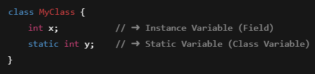

🔑 Isko JVM kahan store karti hai?  

|Type|Storage|
|:---|---:|
|Instance Variable|Heap Memory — Jab object banta hai tab allocate hota hai|
|Static Variable|Method Area / Class Area — Class load hote hi allocate ho jata hai (har object mein copy nahi hoti)|
<br>
	

✅ Default values milti hain:    
Reference: null    
Primitive: 0, 0.0, false, '\u0000' for char  

### Variable agar method ke andar ho  

 then it local variable   
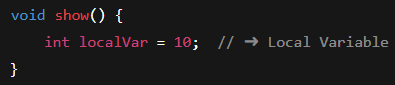


🔥
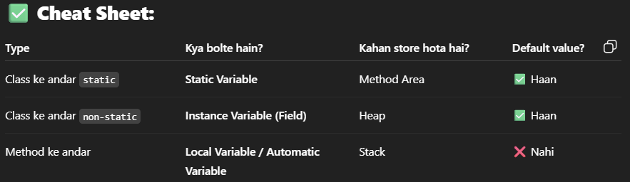


|type||name|
|:---|---|--:|
|inside class - Static||Class variables|
|inside class -nonstatic||instance variables|
|inside method||local variables|

>Agar nested classes aur unke members static hain, toh `chahe kitni bhi nested classes` hoon — direct `class chain` se access ho jayega, `bina kisi object banaye`.  

⏬⏬⏬⏬⏬


<br>
❌ Kab jarurat padegi?    

- Agar nested class ya uske members non-static hain, toh:

    - Outer class ka ya nested class ka object banana hi padega.

    - Kyunki non-static cheez kisi object se bind hoti hai.

Conclusion  
- static → bina instance ke chalega

- non-static (instance) → object banana hi padega


## 1. 
```java
class UpperA {
    static class MiddleClass {
        static void showDetails() {
            System.out.println("This is a static method inside MiddleClass.");
        }
    }
}
```


## 2. 

🚫 Object kab banana padega?  
Agar showDetails() non-static hota:  
```java
class UpperA{
    static class MiddleClass {̥
    void showDetails() {   // ❌ Non-static
        System.out.println("Non-static method.");
    }
}
}
```
Toh tumhe pehle MiddleClass ka object banana padta:  
```java
UpperA.MiddleClass m = new UpperA.MiddleClass();
m.showDetails();
```

## 3.
```java
class UpperA {
     class MiddleClass { 
        static void showDetails() {
            System.out.println("This is a static method inside MiddleClass.");
        }
    }
}
```
- the above code is not allowed in java  
    - Make MiddleClass static, or  
    - Remove the static keyword from the method.


## 4. 
<div align="center">
    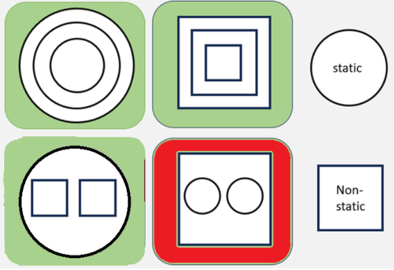  

    ---okayy---
    can center this way too!!!
</div>

## 5. 

</details>
</details>


<br>

# ⚡Constructor Designing

>`“Beforehand we must know how many parameters we will use for an object, and accordingly design our constructor.”`

<details>

1. default construcutor
```java
public class Student {
    String name;
    String branch;
    int sem;

    // Default Constructor
    public Student() { 
    // Java khud default constructor provide karta hai
    // Isme koi parameters nahi hote, aur yeh blank values ko initialize karta hai such as null and 0.
    // hidden not written usually,u can write it too, if u want to have a mixed Construcutor
    }
}

```
Default constructor: "Student banao — par main kuch nahi bata raha ki iska naam kya hai."
Java bolega: "Theek hai, naam null, branch null, sem 0."    
👇👇👇    
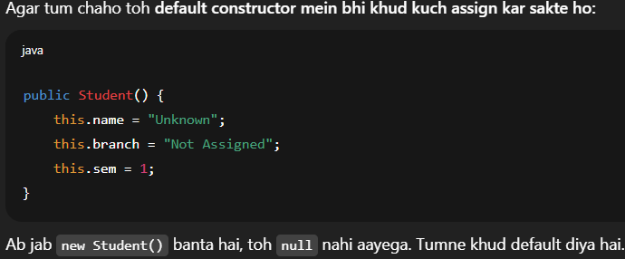

--- 

2. paramemterized construcutor
```java
public class Student {
    String name;
    String branch;
    int sem;

    // Parameterized Constructor
    public Student(String name, String branch, int sem) {
        this.name = name;
        this.branch = branch;
        this.sem = sem;
        // 'this' keyword class ke variables ko indicate karne ke liye hota hai
    }
}

```

3. only default construcutor but u are passing paramemters    
<br>
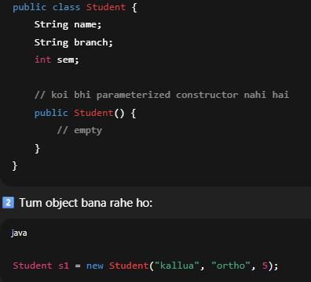

👉 Result:  

💥 Compilation Error!  

Error:  
>constructor Student in class Student cannot be applied to given types;
required: no arguments
found: String, String, int
reason: actual and formal argument lists differ in length

👉 Kyun?  

- Java ke paas Student() wala constructor hai jo koi argument nahi leta.

- Tum new Student("kallua", "ortho", 5) de rahe ho, jo teen argument de raha hai.

- Java ke liye matching constructor nahi mil raha.

👉 Important baat:  

- Agar tum koi bhi constructor define nahi karte ho, toh Java default constructor de deta hai.

- Agar tum koi ek bhi constructor bana dete ho (parameterized), toh Java khud default constructor nahi deta.  

>Matlab agar tumne Student(String name, String branch, int sem) banaya aur Student() nahi banaya, toh ab new Student() se bhi error aayega.  
  

🔻Case 1:  
Maan lo tum chahte ho ki har student ka naam aur branch jaroori hai, lekin sem optional hai:
```java
public class Student {
    String name;
    String branch;
    int sem;

    public Student(String name, String branch) {
        this.name = name;
        this.branch = branch;
        this.sem = 1;  // default semester
    }
}

Student s1 = new Student("Kallua", "Ortho");

```

🔻Case 2:  
Tum multiple constructors bhi bana sakte ho (constructor overloading).
```java
public class Student {
    String name;
    String branch;
    int sem;

    // Constructor 1
    public Student() {
        this.name = "Unknown";
        this.branch = "Not Assigned";
        this.sem = 1;
    }

    // Constructor 2
    public Student(String name, String branch, int sem) {
        this.name = name;
        this.branch = branch;
        this.sem = sem;
    }
}

```

>if u make a construcutor in a class by urself then the default constructor will not work.
```java
class Student {
    String name;
    // Custom constructor
    Student(String name) {
        this.name = name;
    }
}

// Ab yeh allowed nahi hai:
// Student s = new Student(); // ❌ Error: no default constructor
```

</details>

<br>

# ⚡class , instance , static , non-static

<details>

### 1.
- Java mein class matlab ek template ya blueprint.  
- Jaise int ya String datatype hai, waise Student bhi tumhara custom datatype hai.

```java
public class Student {
    String name;           // instance
    int age;               // instance
    static String college = "IIT";  // static

    void details() {
        System.out.println("Name: " + name);
        System.out.println("Age: " + age);
        System.out.println("College: " + college);
    }
}

Student s1 = new Student();
Student s2 = new Student();

s1.name = "Ram";
s2.name = "Shyam";

Student.college = "NIT";  // Static variable updated

```
>but baar baar objects ke variable set krna time consuming hai , to automate this we use `Constructor`
so that we dont have to do it repeatdly.

### 2. 
- Jab tum kisi variable ko static bana dete ho, woh class data member ban jata hai — yaani sab objects ke liye common ho jata hai.

||||
|:---|---:|---:|  
|static|class level|  Static (class-level) variable/method ➜ ClassName.variable ya ClassName.method()|
|bina static|instance level|  Instance (object) variable/method ➜ obj.variable ya obj.method()

<br>  

"Agar koi method class ke andar hai aur woh `dono (instance + class) variables/methods` ko use kar raha hai, toh main yeh follow karunga:
- Instance ke liye: this.variable ya this.method()  
- Static ke liye: ClassName.variable ya ClassName.method()

<br>

## 3. 🔶sameName
```java
class A {
    static String name = "default name"; // static variable
    String name;                         // instance variable

    A(String name) {
        this.name = name;  // yeh instance variable ko set karega
    }

    void showName() {
        System.out.println("Instance name: " + this.name);
    }

    void showStaticName() {
        System.out.println("Static name: " + A.name);
    }
}

```

⚡ Kyun dikkat nahi hoti?  
1️⃣ Scope clear hota hai:  

- this.name → instance variable (object specific)

- A.name → static variable (class level, shared)

Java compiler ye this aur ClassName se differentiate kar leta hai.   

👎❌❌❌❌❌❌ new update , hui **dikkat hui**

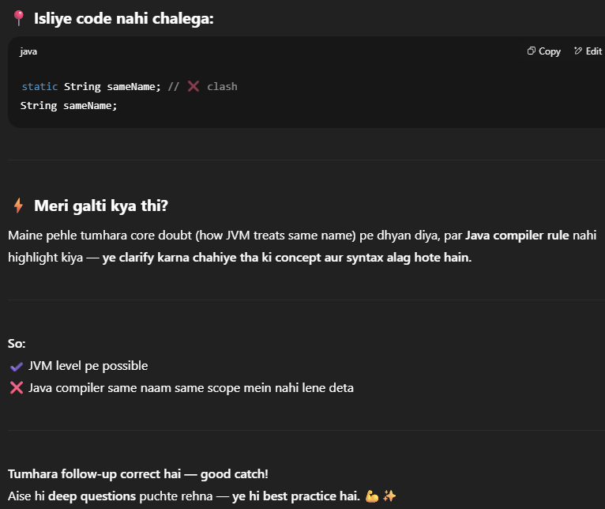
<br>

You're absolutely correct that technically:  

- A.sameName lives in the class/static memory area

- this.sameName lives in heap memory with the object instance

>`But Java prioritizes code safety over this theoretical possibility by enforcing naming uniqueness at the class level`.


## 4. Java mein default value kaise dena chahiye?  

✅ Method A: Multiple Constructors (Constructor Overloading)  
✅ Method B: Field Initialization  
✅ Method C: Builder Pattern (Advanced)
</details>


# ⚡ String  pool

- `String` is a special class in java 

<details>

jvm has a meomry area called the `string constant pool`,
```java
String name = "Doga";
```
java will chk if this name is available in pool
- if present it will use the the existing object.
- if not it will create new object in pool.

now,
```java
String name = new String("Doga");
```
- jvm will forcibly make a neww object in `heap` memory even if `Doga` exits already in pool.
- this is called `Explicit object creation`.

<div align="center">

|Statement|⁉️|Meomry|Performance|
|:---|:---:|:---:|---:|
|`String name="Praka;"`|string literal|String Constant Pool|Fast,Efficient|
|`String name = new String("Praka")`|Explicit object creation|Heap|Slower,moreMeory|
|`Strudent s1 = new Student("Praka")`|ur custom class|Heap|Normal|

</div> 


#### 🔸Deep Dive   
```java
String a ="Hello";
String b ="Hello";
System.out.println(a==b); //true bcoz same object in pool

String c = new String("Hello");
System.out.println(a==c); //false  bcoz c is in heap

```

</details> 

<!-- 
==`javascript`== 
- Closures: Functions that remember their lexical scope, even when called outside it.
- Asynchronous Programming: Callbacks, Promises, async/await, and event loop.
- Prototypes & Inheritance: Prototype chain, constructor functions, Object.create, and ES6 classes.
- This Keyword: Dynamic context, arrow functions vs regular functions, binding.
- Event Delegation: Efficient event handling in the DOM.
- Modules: ES6 modules (import/export), CommonJS, module bundlers.
- Functional Programming Concepts: Higher-order functions, immutability, pure functions.
- Error Handling: Try/catch, custom errors, promise rejection.
- prototype-based objects, first-class functions, and asynchronous programming  -->

<br>

# ⚡more on sameName issue

- runtime and compile time   
<details>   
 
🔑 Your logic is correct about memory  
- static variable → belongs to the class, one copy per class, stored in Method Area (in JVM).

- instance variable → belongs to the object, one copy per object, stored in Heap.

So in memory:
```java
ClassA.staticName → Method Area
ClassA obj → Heap
obj.name → Heap
//They really do not overlap in memory. ✅
```
>this is a compile time issue not a run time issue .
even before the logic of java is processed, the compiler will reject the code on the basis of syntax.

```java
class Car {
    static String color = "White"; // default for all cars
    String color; // instance color

    Car(String color) {
        this.color = color; // sets instance color
    }
}
//This is illegal in Java.  
// Same reason: duplicate field color — even though your logic about memory is fine!
```
`type nul > Car.java ` for windows.  
 In PowerShell, use this to create an empty file:
- New-Item -ItemType File -Name Car.java


>using `try-catch block` to address this issue will also fail.
- because 
    - try-catch block only handles runtime error.
    - Complier will reject the code on the basis of duplicate variable and not even produce the .class file 
    
### 💥WorkAround💥
- use static final 
```java
class Car {
    static final String DEFAULT_COLOR = "White"; // constant for all cars

    String color;

    Car() {
        this.color = DEFAULT_COLOR; // uses default
    }

    Car(String color) {
        this.color = color; // uses given color
    }

    void show() {
        System.out.println("Car color: " + this.color);
    }
}

public class Main {
    public static void main(String[] args) {
        Car car1 = new Car();
        Car car2 = new Car("Red");

        car1.show(); // Car color: White
        car2.show(); // Car color: Red
    }
}

```
✔️ Key points    

DEFAULT_COLOR is shared — all cars know what the default is.
- If you don’t pass a color → the constructor uses the default.
- If you pass a color → you override the default.

⚡ Benefits  
Clear default value for all cars.      
- You can’t accidentally change the default — final prevents it.
- No name conflict → DEFAULT_COLOR and color are different.

### Runtime vs Compile time
>🔑Key point  
🔸try-catch works only for runtime errors (like division by zero, null pointer, file not found).  
🔸Compiler errors happen before the program runs — so the compiler never even creates a .class file for the JVM to run.

❌ But compiler errors can’t be caught  
```java
class A {
  String name;
  static String name; // ❌ Compile-time error → Duplicate field
}
```
➡️ Compiler won’t even generate the .class file → no chance to run try-catch.

</details>

# ⚡Scanner Class
<!-- july24 -->
- why scn.close();
- classcic scanner problem;
- no cursor indicatior.

# ⚡Memory Diagram
- Method area
- Heap 
- Stack
<details>

- Click to see the codeFlow 
[clickMe](https://cscircles.cemc.uwaterloo.ca/java_visualize/#code=public+class+Circle+%7B+++%0A%09%0A%09int+radius%3B%0A%09String+color%3B%0A%09%0A%09static+float+pi+%3D+3.14f%3B%0A%0A%09%0A%09Circle(int+radius)+%7B%0A%09%09this.radius+%3D+radius%3B%0A%09%7D%0A%0A%09%0A%0A%09void+perimeter1()+%7B%0A%09%09float+res+%3D+2+*+this.radius+*+Circle.pi%3B%0A%0A%09%09System.out.printf(%22Circumference+for+the+given+radius+is+%3A-+%25.2f+%25n%22,+res)%3B%0A%09%7D%0A%0A%09void+surfaceArea2()+%7B%0A%09%09float+res+%3D+4+*+pi+*+radius+*+this.radius%3B%0A%09%09System.out.printf(%22Total+surface+Area+for+the+given+radius+is+%3A-+%25.2f+%25n%22,+res)%3B%0A%09%7D%0A%0A%09void+volume3()+%7B%0A%09%09float+res+%3D+pi+*+radius+*+radius+*+radius+*+4+/+3%3B%0A%09%09System.out.printf(%22Volume+for+the+given+radius+is+%3A-+%25.2f%25n%22,+res)%3B%0A%09%7D%0A+++%0A%09static+void+staticInfo4()+%7B%0A%09%09int+x+%3D+360%3B%0A%09%09System.out.printf(%22A+cicrcle+has+%25d+degree's+in+it.+%25n%22,+x)%3B%0A%09%7D%0A%0A%09int%5B%5D+myArr1+%3D+%7B+1,+3,+7+%7D%3B%0A%09static+int%5B%5D+myArr2+%3D+%7B+1,+2,+5,+11+%7D%3B%0A+++public+static+void+main(String%5B%5D+args)+%7B%0A++++++%0A++++++%0A%09%09Circle.staticInfo4()%3B%0A%09%09System.out.println(Circle.pi)%3B%0A%0A%09%09Circle+c1+%3D+new+Circle(1)%3B%0A%09%09%0A%09%09System.out.println(c1)%3B%0A%09%09c1.perimeter1()%3B%0A%09%09c1.volume3()%3B%0A%09%09c1.surfaceArea2()%3B%0A%09%09%0A%09%09Circle+c2+%3D+new+Circle(3)%3B%0A%09%09%0A%09%09c2.volume3()%3B%0A%09%09c2.perimeter1()%3B%0A%09%09c2.surfaceArea2()%3B%0A%09%09System.out.println(c1.myArr1%5B1%5D)%3B%0A%0A%09%09System.out.println(Circle.myArr2%5B2%5D)%3B%0A%0A++++++%0A++++++%0A+++%7D%0A%7D&mode=display&curInstr=0)

</details>

# ⚡Y Inheritance and How?
- also how inheritance and polymorphism are related...
<details>

```java
class Animal {
    void sound() { // ✅ Declared in Animal
        System.out.println("Generic animal sound");
    }
}

class Dog extends Animal {
    @Override
    void sound() { // ✅ Override
        System.out.println("Dog barks");
    }

    void bark() { // ❌ Not declared in Animal
        System.out.println("Dog is barking loudly!");
    }
}

public class Test {
    public static void main(String[] args) {
        Animal a = new Dog();

        // ---- Case 1: Method present in Animal ----
        a.sound(); // ✅ Compile-time: Allowed (Animal has sound)
                   // Runtime: Dog ka version chalega
                   // Output: Dog barks

        // ---- Case 2: Method only in Dog ----
        // a.bark(); // ❌ Compile-time error: bark() not in Animal

        // Agar bark() chalana hai to downcast:
        ((Dog) a).bark(); // ✅ Runtime: Dog is barking loudly!
    }
}

```

>haan tou yehi tou mtlb huya na ki   ?
> 1. a mei return datatype decide karyga ki method chalyga ki nah i age animal classmievo method hai tou chal jayga agr nahi tou error     
>2. agr dono class mei same method name hai  
tb construtor side vala mthed chalyga ??

### 🔶 moreDetailed

```java
class Animal {
    String name;
    void sound() { System.out.println("Grrr..."); }
    void attack() { System.out.println(this.name + " will attack!"); }
}

class Dog extends Animal {
    @Override
    void sound() { System.out.println("Bark Bark"); }
    void bark() { System.out.println("Bhow Bhow"); }
}

class Cat extends Animal {
    // Nothing extra
}

```


</details>

# ⚡Methods

```java
accessModifier returnType methodName(parameters){
    //methodBody
}

```

# ⚡Encapsulation
>*Encapsulation is not a keyword -- its a design principle we apply  when we write classes.
  Inheritance must be explicitly declared using `extends` or `implements`, and once that's done,polymorphism naturally comes into play. Abstraction on the other hand,is when we design classes or interface that hide implementation details and only exposes essential behavior. Together these four concepts -- Encapsulation,Inheritance,Polymorphism,Abstraction -- are the buildind blocks of  OOP in java.*

>***Encapsulation is about how to access data.  
 Abstraction is about what you expose to the outside world.  
 Inheritance and polymorphism are about code reuse and behavior change.***

<details>

- a class designing method/priciple where we use `private` `final` on  data members of the class, so that they are hidden . We also design `getX/setX` methods to access or alter these data members.  
- The way `Constructor's` are designed in this approach is also vital.

- Approach 1 -- `Only getX No setX`

```java
public class Student {
    private final String name;   // 🔒 final banaya
    private String branch;
    private int sem;

    // Constructor se hi set hoga
    public Student(String name) {
        this.name = name;
    }

    public String getName() {
        return name;
    }

    // Branch aur sem ko update karna allowed
    //for that  have to make getter and setter for it.
    public String getBranch() { return branch; }
    public void setBranch(String branch) { this.branch = branch; }

    public int getSem() { return sem; }
    public void setSem(int sem) { this.sem = sem; }
}

//in main() method

    Student s1 = new Student("Ambr");  // name set ho gaya
    System.out.println(s1.getName());  // Ambr
    // s1.setName("Bobby"); ❌ Not possible (no setter)

    // But branch & sem change kar sakte ho
    s1.setBranch("Civil");
    s1.setSem(5);


```

- Approach 2 `Immutabel Class/Using Constructor`

```java
public final class Student {  //⚡observe->"final class" kr di,inheritance Blocked. 
    private final String name;
    private final String branch;
    private final int sem;

    public Student(String name, String branch, int sem) {
        this.name = name;
        this.branch = branch;
        this.sem = sem;
    }

    public String getName() { return name; }
    public String getBranch() { return branch; }
    public int getSem() { return sem; }
}

//in main() method
    Student s1 = new Student("Ambr", "Civil", 5);
    System.out.println(s1.getName()); // Ambr

    // s1.setName("Bobby"); ❌ setter hi nahi hai,this method does not exists.

```  
<br>

>***making a class with `final` keyword , disables it for inheritance.***

</details>

# ⚡Constructor

# ⚡Inheritance & Polymorphism

<details>

1. Inheritance  

- Inheritance means acquiring properties and behaviors (fields and methods) of a parent class into a child class using the extends keyword.
- It helps in code reusability and creates an “is-a” relationship.
- Example:
    - Dog is-an Animal.
    - Cat is-an Animal.  

👉 Methods and variables from Animal are available inside Dog and Cat automatically, but child-specific methods (like bark or meow) are not available in Animal, since inheritance works top-to-bottom, not bottom-to-top.

2. Polymorphism     
- Polymorphism means one interface, many implementations.
- It allows the same method name to behave differently depending on the object at runtime.
- In Java, polymorphism mainly happens through method overriding.

👉 For example, if both Dog and Cat override makeSound(), then:

```java
Animal a = new Dog();
a.makeSound();  // Dog's version will run

a = new Cat();
a.makeSound();  // Cat's version will run

```
Here, the reference type is Animal, but the actual object decides which method runs. This is called runtime polymorphism (or dynamic dispatch).

## Polymorphic variable
>.so the diff is that in polymorphism i have distinct variables c and d whereas in polymorphic var i have same x


## Types of Polymorphism in Java  

1. Compile-Time Polymorphism (Static Polymorphism / Method Overloading)   

    - Achieved using method overloading (same method name, different parameter lists).
    - Decided at compile time by the compiler (based on method signature).  
    - Example:

    ```java
    
    class MathUtils {
        // same method name, different parameter types
        int add(int a, int b) {
            return a + b;
        }

        double add(double a, double b) {
            return a + b;
        }

        int add(int a, int b, int c) {
            return a + b + c;
        }
    }

    public class Test {
        public static void main(String[] args) {
            MathUtils m = new MathUtils();
            System.out.println(m.add(2, 3));       // calls int version
            System.out.println(m.add(2.5, 3.5));   // calls double version
            System.out.println(m.add(1, 2, 3));    // calls 3-arg version
        }
    }

    ```

👉 Here, which method is called is decided at compile-time.

2. Runtime Polymorphism (Dynamic Polymorphism / Method Overriding)  

    - Achieved using method overriding (child class provides its own implementation of a parent method).

    - Decided at runtime by the JVM (based on object type, not reference type).

    - Example:
    ```java
    class Animal {
        void makeSound() {
            System.out.println("Animal sound");
        }
    }

    class Dog extends Animal {
        @Override
        void makeSound() {
            System.out.println("Dog says: Woof Woof!");
        }
    }

    class Cat extends Animal {
        @Override
        void makeSound() {
            System.out.println("Cat says: Meow Meow!");
        }
    }

    public class Test {
        public static void main(String[] args) {
            Animal a;  // polymorphic variable

            a = new Dog();  
            a.makeSound();  // Dog’s version → decided at runtime

            a = new Cat();
            a.makeSound();  // Cat’s version → decided at runtime
        }
    }

    ```

🎯 Interview-Ready Answer  

- If asked “What are the types of polymorphism in Java?”  

“Java supports two types of polymorphism:  
>Compile-time polymorphism (method overloading) – where the same method name has different signatures and the call is resolved at compile time.  

>Runtime polymorphism (method overriding) – where a subclass provides its own implementation of a method, and the call is resolved at runtime based on the actual object, using a polymorphic variable.”


<details>

```java

// Base class
class Animal {
    void makeSound() {
        System.out.println("Some generic sound");
    }
}

// Child classes
class Dog extends Animal {
    void makeSound() {
        System.out.println("Woof!");
    }
}

class Cat extends Animal {
    void makeSound() {
        System.out.println("Meow!");
    }
}

// New class added later
class Bird extends Animal {
    void makeSound() {
        System.out.println("Tweet!");
    }
}

// Factory to decide which Animal to create
class AnimalFactory {
    static Animal getAnimal(String type) {
        switch (type.toLowerCase()) {
            case "dog": return new Dog();
            case "cat": return new Cat();
            case "bird": return new Bird();  // <-- just one new line
            default: return new Animal();
        }
    }
}

public class Zoo {
    public static void main(String[] args) {
        // Suppose these types come from user input or a database:
        String[] animalTypes = {"dog", "cat", "bird"};

        for(String type : animalTypes) {
            Animal a = AnimalFactory.getAnimal(type);
            a.makeSound(); // Calls the correct version automatically
        }
    }
}

``` 

</details>


</details>

# ⚡Abstraction

# ⚡Interface

<details>

#### 1. Syntax

```java
Interface MyInterface{ 
  			void method1(); //implicitly public + abstract
  			int method2();  //implicitly public + abstract  
  		}
```

#### 2. By default
- all methods inside a interface are `public` and `abstract`
>But remember byDesign interface methods are automatically public and abstract. So u delibratly have to use `default` or `static` keyword to make them normal.
- all variables in a interface are constant i.e `public static final`.

#### 3. Implementation
- ClassA implements Interface{}
- a subclass i.e a class which implements an interface --must override all methods mentioned in that interface. ⁉️what if empty login no code just strucutre.
- if all methods are not overridden -- that subclass must be declared with `abstract` keyword. otherwise error.

#### 4. Multiple inhertiance
- class C implements A,B{}
- ⁉️ how does polymorphism work then in this case

#### 5. No construtor

#### 6. Interface vs Abstract class
- how to decide what approach to choose for generic class that will do polymorphism perfectly .

#### 7. New features
- can add normal methods as well using default or static keyword(non-abstract methods,need not implementation )
- static methods can be used  

    ```java
    interface A{
        public static greet(){}
    }

    ```
- private methods also allowed
- 
#### functional interface
- Interface with only one abstract method.
- lambda expressions


</details>

<details>
<summary>enhanced✨</summary>

1. **Methods in interface are** :
    - `public abstract` by default(no body).
    - `default` methods with method body.
    - `static` methods allowed, accessible by `InterfaceName.staticMethodName`
2. **Variables in interface are**:
    - `public static final`(constants).
3. **A class which implements an interface**:-
    - Must override all abstract methods.
    - or else it must decalre itself `abstract`.
4. **A class can implement multiple interfaces**:  
            
        Class SmartPhone implements Camera,MusicPlayer,Telephone{...}

5. **Polymorphism with interface**

```java
Animal x = new Dog();
a.eat1();
//Animal is an interface
//ReturnType instance = new ObjectType();
```

6. **When to use interface**
- for loose coupling
- for multiple inheritance
- for design APIs and Framework(e.g.JDBC uses interfaces like Connection,Statement)

7. **Using variables inside interface**.

>You cannot have non-static variables in a Java interface.    
🔺 All variables declared in an interface are implicitly `public static final` (constants).    
🔺 If you need non-static (instance) variables, you must use a class or an abstract class instead.


```java
        interface Device {
            // Variables are always public, static, final
            int MAX_VOLUME = 100;   // same as: public static final int MAX_VOLUME = 100;
            int MIN_VOLUME = 0;

            void powerOn();   // abstract method
            void powerOff();
        }

        class TV implements Device {
            private int volume = 50;

            public void powerOn() {
                System.out.println("TV is ON. Volume: " + volume);
            }
            public void powerOff() {
                System.out.println("TV is OFF");
            }

            public void increaseVolume() {
                if(volume < MAX_VOLUME) {
                    volume++;
                }
                System.out.println("Volume: " + volume);
            }
        }

        public class Main {
            public static void main(String[] args) {
                System.out.println(Device.MAX_VOLUME); // ✅ access using interface name

                TV sony = new TV();
                sony.powerOn();
                sony.increaseVolume();
                sony.powerOff();
            }
        }

```

### In Java interfaces (since Java 9), **private methods** are allowed, but **private variables are still not allowed**.

- All variables in an interface are always `public static final` (constants).
- You can declare private methods to help with code reuse inside default or static methods, but you cannot have private instance variables.

**Example:**

````java
interface MyInterface {
    int MAX = 100; // public static final

    private void helper() { // private method (Java 9+)
        System.out.println("Helper logic");
    }

    default void show() {
        helper(); // allowed
        System.out.println("Show called");
    }
}
````

**Summary:**  
- ✅✅Private methods: ✔️✔️Allowed (Java 9+)
- ❌❌Private variables: 🚫🚫Not allowed (still only public static final)
- If you need variables with private, protected, or default access, you must use a class or an abstract class.̥


**8. Using Class,Interface,Enum inside an Interface(Nested Stuff)**

<details>

```java
interface Outer {
    void show();

    // Nested interface
    interface Inner {
        void display();
    }

    // Nested class
    class Helper {
        public void help() {
            System.out.println("Helping...");
        }
    }

    // Nested enum
    enum Status { ON, OFF }
}

class Demo implements Outer, Outer.Inner {
    public void show() {
        System.out.println("Outer show()");
    }
    public void display() {
        System.out.println("Inner display()");
    }
}

```

</details>

**9. Interface can implements other interfaces as well**
 
  
</details>

---
# ⚡Interface part2

<details>

#### 1.
---
- Static methods belong to the type that declares them (the interface), not to instances — call them as InterfaceName.method(). You cannot call an interface static method on an object (compile-time error).

- Interface variables are public static final constants. Java lets you write obj.CONST (it resolves at compile time to InterfaceName.CONST), but that’s poor style — prefer InterfaceName.CONST.

- Default methods in interfaces are instance methods — inherited by implementors and callable on objects (obj.defaultMethod()).

#### 2.
---
Why (step-by-step)  

1. Static method = belongs to the declaring type

    - static void battery() in MusicPlayer is part of the MusicPlayer type.

    - It is not an instance method, and interface static methods are not inherited by implementing classes.

    - So only MusicPlayer.battery() is valid. nokia.battery() → compiler error (cannot find symbol: method battery()).

2. Interface variables = public static final constants

    - int volumeLimit = 100; is public static final.

    - When you write nokia.volumeLimit, the compiler resolves that name to the static constant (same as MusicPlayer.volumeLimit).

    - Java allows accessing static fields via an instance reference (it’s resolved at compile time). It’s allowed but discouraged — better to use MusicPlayer.volumeLimit.

3. Default methods are different

    - default void selfie() is an instance method provided to implementors.

    - It is inherited and can be called as nokia.selfie().

4. Under the hood (compile-time lookup)

    - For obj.someName:

        - Field lookup will consider fields declared in the compile-time type and its supertypes/interfaces — so it can find interface constants.

        - Method call obj.someMethod() is resolved against instance methods of the compile-time type (and its supertypes). The compiler will not treat interface static methods as instance methods — hence no match → error.

    - Static methods are not polymorphic; they are resolved by type, not by instance.

5. A word about inlining

    - Interface constants that are compile-time constants may get inlined into calling classes at compile time. If you change the constant in the interface but do not recompile the clients, they may keep the old value. Another reason to treat constants carefully.

**code**
```java
interface MusicPlayer {
    int volumeLimit = 100;         // public static final
    static void battery() {        // static method on the interface
        System.out.println("2 AA battery cells required.");
    }
    default void color() { System.out.println("Black"); } // instance default method
}

class SmartPhone implements MusicPlayer { }

public class Test {
  public static void main(String[] args) {
    SmartPhone nokia = new SmartPhone();
    MusicPlayer.battery();            // OK
    // nokia.battery();               // Compile-time error: method battery() not found on SmartPhone
    System.out.println(MusicPlayer.volumeLimit); // OK
    System.out.println(nokia.volumeLimit);      // ALSO compiles (but use MusicPlayer.volumeLimit)
    nokia.color();                     // OK — default instance method
  }
}

```

6. Best practice (quick)

    - Call interface static methods as InterfaceName.method().

    - Access constants as InterfaceName.CONSTANT.

    - Use default methods via instances (obj.defaultMethod()).

    - Avoid writing obj.CONSTANT or obj.staticMethod() — it’s confusing and poor style.


 

</details>

<!-- <end of interface> -->


# ⚡Access Modifiers
# ⚡Static keyword

# ⚡Inner Class


1. `A class defined inside another class`.
  
2. Types
    - Static inner class
    - Non-static inner class
    - method inner class
    - Anonymous Inner class


3. Key points
    - Outer class is called "Enclosing Class".
    - static things can not use non-static thing directly , it has too have a objectReferenec.
    - whereas a non static class or member can reach out and use static things directly.[no need to make an object] 

    - both static and nonStatic inner classes can access enclosing classes private variables
    as per static/nonstaic type.


4. Why
    - Logiacl grouping,Encapsulation,Readability,Event Handling /callbacks

    
### Static Inner class
- static keyword
- Does not require the enclosing class object.
- can only access static members of the outer class.(since nonstatic inside a static , not allowed.)

```java
class Car{
    static String company ="Tesla";

    static class Battery{
        void charge(){
            System.out.println("Charging "+company+"battery...");
        }
    }
}

public class Main{
    public static void main(String[] args) {
        Car.Battery car1 = new Car.Battery();
        car1.chargey();
    }
}
```

    
    
### Non Static-Inner class
- Related to instance of outer class.
- can access all members(even private) of outer class/enclosing class.
- non static Inner class object is always tied to the Outer class object.
- obj.new Inner();

### Method-local Inner class
- coded inside a method Outer class.
- Scope is just within the method.
- 

### Anonymous class
- Trickest
- See the class is already mentioned in the code, its just that we can make adhoc changes to the 
  methods that can be overridden, with out going to actually go the class file and make those changes there.?
- A x = new A/subA(){ override methods whichare present in classA/interfaceA}
- You can also add extra methods but they have to be mentioned in the parent class.?
- Anonymous class always is implementing a existing type(normalClaas/abstract class/interface).
- jo method tum override krte ho usko parent class mei declare hona mandatory hai.

- `new SomeType() {}` must  exists
    - either as interface or abstract class or concrete class.Compiler needs `SomeType`.
    - 

```java
Thread t2 = new Thread() {
    @Override
    public void run() {
        System.out.println("Anonymous Thread subclass run()");
    }
};
t2.start();

```

```java
interface A {
    void method1();
    void method2();
}

class B implements A {
    public void method1() {
        System.out.println("hi im m1");
    }
    public void method2() {
        System.out.println("hi im m2");
    }
}

public class Main {
    public static void main(String[] args) {
        A x = new B() {
            @Override
            public void method1() {
                System.out.println("hello im newer m1");
            }

            // ❌ yeh default method anonymous class me nahi chalega
            // public void extra() {
            //     System.out.println("freshly made method here hi");
            // }
        };

        x.method1();  // prints: hello im newer m1
        x.method2();  // prints: hi im m2
    }
}

```
#### More Anonymous 

<details>

### Q1 – Kya anonymous class me interface ke sare methods implement karne padenge?

👉 Depends on case:  

1. Agar tum direct new A() { ... } likhte ho

    - To interface ke sare abstract methods implement karna compulsory hai, kyunki tum directly A ko implement kar rahe ho.
```java
A obj = new A() {
    public void method1() { System.out.println("m1"); }
    public void method2() { System.out.println("m2"); }
};
```

2. Agar tum kisi class B ka object bana rahe ho jo pehle hi A implement karti hai

    - To uske methods pehle se implemented hain, tum sirf chahe to kuch methods override kar sakte ho, zaroori nahi sab karna.
```java
A obj = new B() {
    @Override
    public void method1() { System.out.println("new m1"); }
    // method2() pehle se B me hai, override karna optional hai
};
```

✅ Tumhare example me B already dono methods implement karta hai, isliye anonymous class me tumhe dono likhne ki zaroorat nahi — sirf method1() override kiya to bhi chalega.

---


### Q2 – Extra methods jo parent class/interface me nahi hain, bana sakte hain kya?

👉 Haan, bana sakte ho but ek problem hai:  

- Reference type (A x = ...) ke through unhe call nahi kar paoge.

- Kyunki compiler ko A ke methods hi dikhai dete hain.

- Tumhara extra() method runtime par object me hoga, lekin compile-time pe accessible nahi hoga.

Example:
```java
A x = new B() {
    @Override
    public void method1() {
        System.out.println("new m1");
    }
    public void extra() {
        System.out.println("fresh method");
    }
};

x.method1(); // ✅ okay
// x.extra();  // ❌ compile error: method not found in type A
```

⚠️ Tum reflection use karke call kar sakte ho, lekin normally aise methods ka fayda nahi hai.

---

### Q3 – Anonymous class me sirf parent class/interface ke same-name methods hi override hote hain?

👉 Bilkul ✔️.

- Jo methods parent type (class/interface) me declare hue hain, unhi ko override kar sakte ho.

- Agar same-name method likhoge → override hoga.

- Agar new naam ka method likhoge → woh bas us anonymous class ka internal method ban jayega, reference type ke through call nahi hoga.
```java
Example:

class C {
    void show() { System.out.println("C show"); }
}

public class Main {
    public static void main(String[] args) {
        C obj = new C() {
            @Override
            void show() { // override
                System.out.println("Anonymous override show");
            }
            void hello() { // new method
                System.out.println("New method in anonymous");
            }
        };

        obj.show();   // prints: Anonymous override show
        // obj.hello(); // ❌ compile error: hello() not defined in type C
    }
}
```
---
✅ Summary (Interview-ready)  

1. Implement all methods?

    - If directly implementing interface → yes, all.

    - If extending a concrete class (that already implements interface) → only override what you need.

2. Extra methods?

    - Can be written, but not accessible via parent type reference.

3. Which methods get overridden?

    - Only those declared in parent type (class/interface). New methods are hidden unless you cast or use reflection.

</details>

### ⁉️⁉️Questions⁉️⁉️

1. 

<details>

Great question! Here’s why your code doesn’t work:

### Why not `Car car1 = new Battery();`?

- **`Battery` is a static inner class inside `Car`.**
- It is NOT a subclass of `Car` — it’s a separate class nested inside `Car`.
- There is **no inheritance** between `Car` and `Battery`.

#### Polymorphism only works when there is inheritance:
- Example:  
  ```java
  class Animal {}
  class Dog extends Animal {}
  Animal a = new Dog(); // ✅ Allowed (Dog IS-A Animal)
  ```

#### In your case:
- `Car.Battery` is NOT a subclass of `Car`.
- So, `Car car1 = new Battery();` is a **compile-time error**:  
  > "incompatible types: Battery cannot be converted to Car"

#### Correct usage:
- You must use the fully qualified name:
  ```java
  Car.Battery car1 = new Car.Battery();
  car1.charge();
  ```

#### Summary:
- **Static inner class ≠ subclass.**
- No polymorphism between enclosing class and its static inner class.
- Use `Car.Battery` as the type, not `Car`.

If you want polymorphism, you need inheritance (`extends`). Static inner classes are just nested classes, not child classes.

</details>

2. why to make a engine class, instead just make a method?

<details>

#### so yes we can do that, but that would have limited use.
- supoose later u wan tmore function/features  to add to it . If you add all the features to a single method 
they all would run at the same time .
- Inner class gives you option to be selective and use particular functions.
-`We can even use a static inner class without needing the enclosing class object`.

```java
class Car {
    private String brand ="Tesla";
    //sirf ek method banana ho toh aisa kr sakte hain 
    void startEngine() {
        System.out.println("engine of "+brand+"is starting...");
    }

    //but  if u make a class Engine , you could add more features to it

    Class Engine{
        void start() {Sysout("Engine of"+brand+"is sitting...");}
        void checkOil() {Sysout("Oil level is OK.");}
    }
}
```

</details>

3. Que

<details>

👉 Agar tum Engine ko non-static inner class banate ho, toh woh Car ke object ke bina exist nahi kar sakta. Matlab:

Car car = new Car();
Car.Engine engine = car.new Engine();


⚠️ Problem: Ab tum Engine ko Truck ya Bike ke saath reuse nahi kar paoge.

✅ Solution → Engine ko static nested class bana do (ya phir completely alag top-level class bana do).

Example:

```java
class Car {
    String brand;
    Car(String brand) { this.brand = brand; }

    // Static nested class
    static class Engine {
        void start(String brand) {
            System.out.println("Engine of " + brand + " is starting...");
        }
    }
}

class Truck {
    String brand;
    Truck(String brand) { this.brand = brand; }
}

class Bike {
    String brand;
    Bike(String brand) { this.brand = brand; }
}

public class Main {
    public static void main(String[] args) {
        // Car ke saath Engine use
        Car car = new Car("Tesla");
        Car.Engine engine1 = new Car.Engine();
        engine1.start(car.brand);

        // Truck ke saath Engine use
        Truck truck = new Truck("Volvo");
        Car.Engine engine2 = new Car.Engine();
        engine2.start(truck.brand);

        // Bike ke saath Engine use
        Bike bike = new Bike("Yamaha");
        Car.Engine engine3 = new Car.Engine();
        engine3.start(bike.brand);
    }
}
//output 
Engine of Tesla is starting...
Engine of Volvo is starting...
Engine of Yamaha is starting...

```

</details>

---

### Recap
### 💛💛Gold⚒️Mine


### 1. Quick recap — Static nested vs Non-static inner  

- Non-static inner class (aka member inner class): `class Outer { class Inner { ... } }`

    - Har Inner object ka ek Outer instance se link hota hai (`Outer.this`).

    - Instantiate karne ke liye outer instance chahiye: `Outer o = new Outer(); Outer.Inner i = o.new Inner();`

    - Inner class can access outer’s instance members (even private).

    - Inner class cannot declare static members (except `static final` constants).

- Static nested class: class Outer { static class Nested { ... } }

    - No link to an Outer instance. Works like a top-level class namespaced inside Outer.

    - Instantiate without outer: Outer.Nested n = new Outer.Nested();

    - Static nested class can have static members.

###  2. Syntax rules & type names

- Type name for nested classes (any level) is written with dots: Outer.Middle.Inner (this is the type).

- Instantiation depends on whether the class you are creating is static or non-static:

    - Static nested: Outer.Middle.Inner obj = new Outer.Middle.Inner();

    - Non-static inner: you must first create the enclosing instance(s), then use outerRef.new Inner():

        - `Outer outer = new Outer(); Outer.Middle middle = outer.new Middle();`
          `Outer.Middle.Inner inner = middle.new Inner();`

- Inside the outer class instance methods, you can use new Middle() / new Inner() directly (no outer. needed) because this is implied.

- Important rule: You cannot declare a static member class inside a non-static inner class. (Static member classes are allowed only in top-level classes or inside other static member classes.)

### 3. Three-tier examples (practical) — multiple permutations + how to make objects

#### 3.1 Case A — Outer → (non-static) Middle → (non-static) Inner

All are non-static member classes. Inner tied to Middle instance; Middle tied to Outer instance.
```java
public class OuterA {
    String name = "OUTER-A";

    class Middle {
        String m = "MIDDLE-A";

        class Inner {
            void show() {
                System.out.println(name + " -> " + m + " -> INNER-A");
            }
        }
    }

    public static void main(String[] args) {
        // 1) create Outer instance
        OuterA outer = new OuterA();

        // 2) create Middle bound to outer
        OuterA.Middle middle = outer.new Middle();

        // 3) create Inner bound to middle (and transitively to outer)
        OuterA.Middle.Inner inner = middle.new Inner();

        inner.show(); // prints: OUTER-A -> MIDDLE-A -> INNER-A
    }
}
```


#### Summary for Case A (non-static → non-static → non-static):

- Type name: OuterA.Middle.Inner

- Instantiate steps:

    1. OuterA outer = new OuterA();

    2. OuterA.Middle middle = outer.new Middle();

    3. OuterA.Middle.Inner inner = middle.new Inner();

#### 3.2 Case B — Outer → (static) Middle → (non-static) Inner

Middle is static. You can create Middle without Outer. Inner is non-static inside Middle, so Inner tied to Middle instance.

```java
public class OuterB {
    static class Middle {
        String m = "MIDDLE-B";

        class Inner {
            void show() {
                System.out.println("Inner inside static Middle: " + m);
            }
        }
    }

    public static void main(String[] args) {
        // 1) Middle is static — create it directly
        OuterB.Middle middle = new OuterB.Middle();

        // 2) Inner is non-static of Middle — needs middle instance
        OuterB.Middle.Inner inner = middle.new Inner();

        inner.show(); // prints: Inner inside static Middle: MIDDLE-B
    }
}
```

#### Summary for Case B (static Middle → non-static Inner):

- Type: OuterB.Middle.Inner

- Instantiate:

    1. OuterB.Middle middle = new OuterB.Middle();

    2. OuterB.Middle.Inner inner = middle.new Inner();

#### 3.3 Case C — Outer → (static) Middle → (static) Inner

Both nested classes are static. No outer/middle instances required to create inner.
```java
public class OuterC {
    static class Middle {
        static class Inner {
            static void staticShow() {
                System.out.println("Static Inner in static Middle - staticShow");
            }
            void show() {
                System.out.println("Static Inner in static Middle - instance show");
            }
        }
    }

    public static void main(String[] args) {
        // static method call
        OuterC.Middle.Inner.staticShow();

        // create instance directly
        OuterC.Middle.Inner inner = new OuterC.Middle.Inner();
        inner.show();
    }
}
```


#### Summary for Case C (static → static):

- Type: OuterC.Middle.Inner

- Instantiate: new OuterC.Middle.Inner() (no outer/middle object needed)

### 3.4 Forbidden case (Illegal) — Outer → (non-static) Middle → (static) Inner

You cannot put a static member class inside a non-static member class. This will give compile error.
```java
class Outer {
    class Middle {
        static class Inner { } // ❌ compile error: static declarations in inner classes are not allowed
    }
}
```

Rule: static member classes are allowed only in top-level classes or static member classes.

## 4. Instantiation Cheat-Sheet (short)
|Nested type|Type name (use)|How to create|
|---|---|---|		
|`Outer.Inner` non-static|	`Outer.Inner x`	|`Outer o = new Outer(); Outer.Inner x = o.new Inner()`;|
|`Outer.StaticNested`|	`Outer.StaticNested x`	|`Outer.StaticNested x = new Outer.StaticNested();`|
|3-tier static→static|	`Outer.Middle.Inner`|	`new Outer.Middle.Inner()`|
|3-tier static→non-static|	`Outer.Middle.Inner`	|`Outer.Middle mid = new Outer.Middle(); Outer.Middle.Inner i = mid.new Inner();`|
|3-tier non-static→non-static|	`Outer.Middle.Inner`|	`Outer o = new Outer(); Outer.Middle m = o.new Middle(); Outer.Middle.Inner i = m.new Inner();`|

>Note: You can always declare a variable using the dotted type name (e.g., Outer.Middle.Inner var;) but creation expression must follow the rules above.

## 5. Using type as return type obj = new targetClass() pattern

You can write:
```java
Outer.Middle.Inner ref = /* appropriate creation expression (see above) */;
```

So the left side is the type (Outer.Middle.Inner) and the right side is how you create the object (may require outer.new Middle() etc.). Example:
```java
OuterA outer = new OuterA();
OuterA.Middle middle = outer.new Middle();
OuterA.Middle.Inner obj = middle.new Inner();
return obj; // if your method return type is OuterA.Middle.Inner
```
## 6. Extra notes & tips (interview ready)

- Why use static nested? When nested type does not need access to outer instance — it’s cleaner and avoids unnecessary Outer reference.

- Why use non-static inner? When inner needs access to outer’s instance fields/methods (even private).

- Fully qualified name: packageName.Outer.Middle.Inner if you need the full path.

- From within Outer instance methods you can write new Middle() or new Middle().new Inner() (if allowed) because this is implied.

- From static context (like public static void main) you cannot just new Middle() if Middle is non-static — you first need an Outer instance.

- Anonymous classes can be used to create quick subclasses/implementations, but their instantiation rules follow same static/non-static binding (if anonymous subclass is for a non-static inner class, you must still have its outer instance).


## 7.Final

```java
public class NestedDemo {
    // Case A: non-static -> non-static -> non-static
    static class CaseA {
        static class Demo {
            // just a holder for structure
        }
    }

    // Real examples:
    // 1) non-static Middle -> non-static Inner
    static class Ex1 {
        // top-level for demo only (we mimic OuterA structure):
        static class OuterA {
            String name = "OUTER-A";
            class Middle {
                String m = "MIDDLE-A";
                class Inner {
                    void show() { System.out.println("A: " + name + "->" + m + "->INNER"); }
                }
            }
        }
        static void run() {
            OuterA outer = new OuterA();
            OuterA.Middle middle = outer.new Middle();
            OuterA.Middle.Inner inner = middle.new Inner();
            inner.show();
        }
    }

    // 2) static Middle -> non-static Inner
    static class Ex2 {
        static class OuterB {
            static class Middle {
                String m = "MIDDLE-B";
                class Inner {
                    void show() { System.out.println("B: Inner inside static Middle: " + m); }
                }
            }
        }
        static void run() {
            OuterB.Middle middle = new OuterB.Middle();
            OuterB.Middle.Inner inner = middle.new Inner();
            inner.show();
        }
    }

    // 3) static Middle -> static Inner
    static class Ex3 {
        static class OuterC {
            static class Middle {
                static class Inner {
                    static void staticShow() { System.out.println("C: Static Inner staticShow"); }
                    void show() { System.out.println("C: Static Inner instance show"); }
                }
            }
        }
        static void run() {
            OuterC.Middle.Inner.staticShow();
            OuterC.Middle.Inner inner = new OuterC.Middle.Inner();
            inner.show();
        }
    }

    public static void main(String[] args) {
        Ex1.run();
        Ex2.run();
        Ex3.run();
    }
}

```
<br>


# ⚡Scanner Issue

<details>


## ⚡ Problem
`nextInt()` number ko read karta hai **par newline (`\n`) buffer mein chhod deta hai**.  
Agar turant `nextLine()` call karo to woh leftover `\n` consume karke **empty string** return karega.

---

## ⚡ Behaviour — Cheat Sheet
- `nextInt()` → reads number (token), leaves newline.
- `nextLine()` → reads full line (till `\n`), consumes newline.
- `next()` → reads only next token (space/newline separated).
- `nextInt()` → `nextInt()` → ✅ safe.
- `nextInt()` → `nextLine()` → 🚨 problem (first `nextLine()` becomes `""`).

---
```java
int number1 = scn.nextInt();   // yaha user se ek number lega
scn.nextInt();                 // ek aur number lega
String name = scn.nextLine();  // string lega
int number2 = scn.nextInt();   // fir ek aur number lega

// 1 
// 2
// 3
```
⚡ Scanner ka behavior:     

nextInt() → 1 le liya ✅  
Buffer mei abhi bhi \n (Enter key) baaki hai.   

Dusra nextInt() → 2 le liya ✅   
Fir se buffer mei ek \n bacha hai.    

nextLine() → Ye sirf woh bacha hua newline (\n) consume karega 🚨   
Isliye name empty string ("") ban gaya.   

nextInt() → Ab 3 lega ✅   


---

**✅ Best Practice / Fix**  

Agar tum mix kar rahe ho nextInt() + nextLine(), to extra nextLine() daalna padta hai newline consume karne ke liye. 

</details>


# ⚡Exception Handling

<details>

***One of the complicated/cpmplex topic in java ,I struggled with ***
- by default all classes extends Object classes, and therefore haccccve a tostring method().
        
        public String toString() {return getClass().getName() + "@" + Integer.toHexString(hashCode());}
- You can override toString method().


</details>

# ⚡Wrapper class

1. WrapperClass
    - **Wrapper classes allow us to treat primitives as objects**.
    - each primitive has its own wrapper class;

2. Why do we need Wrapper Classes?

    ✅ To work with Collections/Generics (since collections store only objects).  
    ✅ Provide utility methods (e.g., parsing, conversion).  
    ✅ Help in type conversion (String → int, int → String).  
    ✅ Allow null values (primitive can’t hold null, but wrapper can).  
    ✅ Autoboxing/Unboxing introduced to make life easier.


3. code
```java
//depriciated
    Integer a = new Integer(123);
    Double b = new Double(3.14);
    Character c = new Character('v');
    Boolean d = new Boolean(true);
//modern-way 
    //Also called the "AUTO-BOXING"
    Integer a = 123;
    Double b = 3.14;
    Character c = '$';
    Boolean d = false;

    String
//UN-BOXING
    //from a object back to primitive
    int x = Integer.intValue(a); 
    //or
    int x1 = a;
    //both are acheiving same goal


```


# ⚡File operation read/write

<details>

**I thought file handling was complex, until i came across file i/o**

#### So many classes to  do file io in different senarios,at times confusing.


### table

| File Type   | Class                  | Purpose                                   | Key Methods                                                                                           | Creates File?                 | Read? | Write? | Efficient? | Notes / When to Use                                                                      |
| ----------- | ---------------------- | ----------------------------------------- | ----------------------------------------------------------------------------------------------------- | ----------------------------- | ----- | ------ | ---------- | ---------------------------------------------------------------------------------------- |
| Text        | `File`                 | Represent file/dir path & metadata        | `createNewFile()`, `exists()`, `delete()`, `length()`, `getAbsolutePath()`, `canRead()`, `canWrite()` | ✅ (with createNewFile)        | ❌     | ❌      | N/A        | Use for existence check, file info, delete, list directory                               |
| Text        | `FileWriter`           | Write characters to file                  | `write(String)`, `write(char[])`, `append(String)`, `close()`                                         | ✅ (if file not exist)         | ❌     | ✅      | ❌          | Overwrites by default; use try-with-resources; good for small files                      |
| Text        | `FileReader`           | Read characters from file                 | `read()`, `read(char[])`, `close()`                                                                   | ❌                             | ✅     | ❌      | ❌          | Reads char-by-char; wrap in BufferedReader for line-by-line                              |
| Text        | `BufferedWriter`       | Efficient text write                      | `write(String)`, `write(char[])`, `newLine()`, `flush()`, `close()`                                   | ✅ (via underlying FileWriter) | ❌     | ✅      | ✅          | Wraps FileWriter; reduces IO; use for medium/large files                                 |
| Text        | `BufferedReader`       | Efficient text read                       | `read()`, `read(char[])`, `readLine()`, `close()`                                                     | ❌                             | ✅     | ❌      | ✅          | Wraps FileReader; use for line-by-line reading; better performance than FileReader alone |
| Text        | `PrintWriter`          | Formatted writing                         | `println()`, `printf()`, `write(String)`, `flush()`, `close()`                                        | ✅ (via FileWriter)            | ❌     | ✅      | ✅          | Convenient for formatted output; auto-flush optional                                     |
| Text        | `Scanner`              | Parse text (tokens/lines)                 | `nextLine()`, `nextInt()`, `hasNextLine()`, `close()`                                                 | ❌                             | ✅     | ❌      | ✅          | Great for structured text parsing (numbers, strings, tokens)                             |
| Text        | `Files` (NIO)          | Modern file operations                    | `writeString(Path, String)`, `readString(Path)`, `exists(Path)`, `delete(Path)`, `readAllLines(Path)` | ✅                             | ✅     | ✅      | ✅          | One-liner read/write; supports UTF-8; simple API; small to medium files                  |
| Binary      | `FileOutputStream`     | Write bytes                               | `write(int)`, `write(byte[])`, `write(byte[], int, int)`, `flush()`, `close()`                        | ✅                             | ❌     | ✅      | ❌          | Use for binary files (images, audio); can append via constructor                         |
| Binary      | `FileInputStream`      | Read bytes                                | `read()`, `read(byte[])`, `read(byte[], int, int)`, `close()`                                         | ❌                             | ✅     | ❌      | ❌          | Read binary data; wrap in BufferedInputStream for efficiency                             |
| Binary      | `BufferedOutputStream` | Efficient binary write                    | `write(int)`, `write(byte[])`, `flush()`, `close()`                                                   | ✅ (via FileOutputStream)      | ❌     | ✅      | ✅          | Wraps FileOutputStream; reduces disk IO; use for large files                             |
| Binary      | `BufferedInputStream`  | Efficient binary read                     | `read()`, `read(byte[])`, `close()`                                                                   | ❌                             | ✅     | ❌      | ✅          | Wraps FileInputStream; use for large binary files                                        |
| Binary/Text | `DataOutputStream`     | Write primitives (int, double, UTF, etc.) | `writeInt()`, `writeDouble()`, `writeUTF()`, `flush()`, `close()`                                     | ✅ (via underlying stream)     | ❌     | ✅      | ✅          | Can write both text & binary; often wrapped over BufferedOutputStream                    |
| Binary/Text | `DataInputStream`      | Read primitives                           | `readInt()`, `readDouble()`, `readUTF()`, `close()`                                                   | ❌                             | ✅     | ❌      | ✅          | Often wrapped over BufferedInputStream; reads what DataOutputStream wrote                |


### 1.Why even use File
 Bingo ✅ tumne sahi samjha!  
Haan, agar tumhe sirf file create + write karna hai, to FileWriter class use karke tumhe File class alag se banane ki zaroorat nahi hai. FileWriter can write in files as well as create a file to write in it if it does not exists.

**But**  
- Jab File class kaam aati hai
    - Tumhe File class tab use karni padti hai jab:
    - Sirf file banana hai bina likhe.
    - File ke properties check karne hai (size, readable, writable, path, hidden, etc.).
    - File ke existence check ya multiple files list karne hain.
    ```java
    File f = new File("myfile.txt");
    System.out.println("Absolute path: " + f.getAbsolutePath());
    System.out.println("Readable? " + f.canRead());
    System.out.println("File size: " + f.length() + " bytes");
    ```

🔑 Summary

✅ FileWriter → direct file create + write.

✅ File → metadata + file management operations.

<details>

| Feature / Aspect       | **File** (`java.io.File`)                                                                                           | **FileWriter** (`java.io.FileWriter`)                                                      |
| ---------------------- | ------------------------------------------------------------------------------------------------------------------- | ------------------------------------------------------------------------------------------ |
| **Purpose**            | File ya directory ka path represent karta hai                                                                       | File me text data likhne ke liye stream                                                    |
| **Creates file?**      | Haan, but explicitly via `createNewFile()`                                                                          | Haan, agar file exist nahi karti to bana deta hai                                          |
| **Can write content?** | ❌ Nahi (sirf existence/info check karta hai)                                                                        | ✅ Haan (string/characters likhta hai)                                                      |
| **Can read content?**  | ❌ Nahi                                                                                                              | ❌ Nahi (sirf write karne ke liye hai)                                                      |
| **Use cases**          | - Check if file exists<br>- Get file size, permissions, absolute path<br>- Delete file<br>- List directory contents | - Write data into file (overwrite ya append)<br>- Use with `BufferedWriter` for efficiency |
| **Close required?**    | ❌ Nahi (resource nahi hai)                                                                                          | ✅ Haan (IO resource hai, best to use try-with-resources)                                   |
| **Package**            | `java.io.File`                                                                                                      | `java.io.FileWriter`                                                                       |
| **Relation**           | File = "address of file in filesystem"                                                                              | FileWriter = "pen to write content inside file"                                            |

</details>

### 2. File Writer
- Jab tum new FileWriter("myfile.txt") likhte ho:  
- Agar "myfile.txt" file exist nahi karti → FileWriter usko create kar deta hai.  
- Agar file already exist karti hai → uska purana content overwrite ho jaata hai (jab tak tum `true` flag pass nahi karte append ke liye).
    ```java
    import java.io.FileWriter;
    import java.io.IOException;

    public class WriteFile {
        public static void main(String[] args) {
            try (FileWriter writer = new FileWriter("myfile.txt")) { // auto-close
                writer.write("Hello, this file is created directly with FileWriter!");
                System.out.println("File written successfully.");
            } catch (IOException e) {
                e.printStackTrace();
            }
        }
    }

    ```

### 3. FileReader
- FileReader sirf read karne ke liye hai.

- File must exist, otherwise FileNotFoundException aayega.

### 4. BufferWriter/BufferReader(text)


`BufferedWriter → wraps FileWriter → writes efficiently in large chunks, reduces disk IO`

`BufferedReader → wraps FileReader → reads line by line or efficiently in chunks`

Key methods:

- BufferedWriter.write(String)

- BufferedWriter.newLine()

- BufferedReader.readLine()

```java

try (BufferedWriter bw = new BufferedWriter(new FileWriter("out.txt"))) {
    bw.write("Hello World");
    bw.newLine();
    bw.write("Second line");
}
```
```java

try (BufferedReader br = new BufferedReader(new FileReader("out.txt"))) {
    String line;
    while ((line = br.readLine()) != null) {
        System.out.println(line);
    }
}
```
✅ Buffered classes are faster and more convenient for text files than FileReader/FileWriter directly.

## 5. Always use try-with-resources for IO classes (FileReader, FileWriter, BufferedReader/Writer, Scanner)

## 6. Text vs Binary:

- Text → FileWriter, FileReader, BufferedWriter/Reader, PrintWriter, Scanner

- Binary → FileInputStream/OutputStream, BufferedInputStream/OutputStream, DataInput/OutputStream


## 7.

1️⃣ Text Files  
- File  
- FileWriter  
- FileReader
- BufferWriter
- BufferReader
- File(nio)

2️⃣ Binary Files    
- FileInputStream
- FileOutputStream
- BufferInputStream
- BufferOutputStream

## 8.
 **Mostly you can ignore the unbuffered classes (FileReader, FileWriter, FileInputStream, FileOutputStream)in practice if you always wrap them with buffered classes. But there are some subtle points to be aware of:**

1️⃣ How Buffered Classes Work  

- BufferedReader wraps a Reader (like FileReader)

- BufferedWriter wraps a Writer (like FileWriter)

- BufferedInputStream wraps an InputStream (like FileInputStream)

- BufferedOutputStream wraps an OutputStream (like FileOutputStream)

**So you still need to provide the underlying file stream, e.g.:**
```java
BufferedReader br = new BufferedReader(new FileReader("file.txt"));
BufferedWriter bw = new BufferedWriter(new FileWriter("file.txt"));
BufferedInputStream bis = new BufferedInputStream(new FileInputStream("file.bin"));
BufferedOutputStream bos = new BufferedOutputStream(new FileOutputStream("file.bin"));

```

2️⃣When You Can Ignore the Unbuffered Classes  

- `If your workflow is always buffered, i.e., you always wrap FileReader/FileWriter or FileInputStream/OutputStream:`

- `You can think of unbuffered classes as just the “base”, not something you use directly.`

- `Buffered classes will take care of efficiency automatically.`

   
</details>

<details><summary>part2</summary>

## Understand Bit-->byte


</details>


---

# ⚡more Wrapper

<details><summary>continued...</summary>

## 1.

- Step 1: What you know about wrapper classes  
    ```java
    // Primitive int
    int x = 5;

    // Wrapper class Integer
    Integer a = new Integer(x);   // wraps int in an object

    // Convert back to primitive
    int y = a.intValue();         // unwrap

    ```
✅ Here, Integer wraps the primitive and gives you extra functionality (like methods, null support, etc.)


- Step 2: File IO – Similar concept

    - Unbuffered stream → like primitive (FileReader, FileWriter)

    - Buffered stream → like wrapper (BufferedReader, BufferedWriter)

    ```java
        // Unbuffered: basic primitive-level IO
    FileReader fr = new FileReader("file.txt");

    // Buffered: wraps fr for efficiency, like Integer wraps int
    BufferedReader br = new BufferedReader(fr);

    // Now br gives extra “methods” like readLine(), better performance
    String line = br.readLine();

    ```
    `Instead of doing it in two steps:`
    ```java
    FileReader fr = new FileReader("file.txt");         // Step 1: create unbuffered
    BufferedReader br = new BufferedReader(fr);         // Step 2: wrap it
    ```
    You can directly pass the new object as a parameter:
    ```java
    BufferedReader br = new BufferedReader(new FileReader("file.txt"));
    ```

    ✅ This works perfectly. Java evaluates the new FileReader("file.txt") first, then passes it to the BufferedReader constructor.

    - Think of it like passing an int to Integer constructor directly:
    ```java
    Integer a = new Integer(5);    // wraps 5 directly, no need for int x first
    ```

## 2. 

1. Primitive → Wrapper (boxing)

2. Wrapper → Primitive (unboxing)

**Java Wrapper Class Demo – Concept Clearing**
```java
public class WrapperDemo {

    public static void main(String[] args) {

        // -------------------------------
        // 1️⃣ Primitive → Wrapper (Boxing)
        // -------------------------------
        int num = 42;                       // primitive int
        Integer wrappedNum = Integer.valueOf(num); // explicit boxing
        System.out.println("Wrapped value: " + wrappedNum);

        // -------------------------------
        // 2️⃣ Wrapper → Primitive (Unboxing)
        // -------------------------------
        int unboxed = wrappedNum.intValue(); // explicit unboxing
        System.out.println("Unboxed value: " + unboxed);

        // -------------------------------
        // 3️⃣ Auto-boxing / Auto-unboxing
        // -------------------------------
        Integer autoBoxed = num;            // primitive automatically wrapped
        int autoUnboxed = autoBoxed;        // wrapper automatically converted to primitive
        System.out.println("Auto-boxed value: " + autoBoxed);
        System.out.println("Auto-unboxed value: " + autoUnboxed);

        // -------------------------------
        // 4️⃣ Practical Example: Collection
        // -------------------------------
        java.util.ArrayList<Integer> list = new java.util.ArrayList<>();
        
        // Cannot store primitives directly in ArrayList
        // list.add(num); // Works because auto-boxing converts int → Integer

        list.add(num);                       // auto-boxed
        list.add(99);                        // auto-boxed
        System.out.println("ArrayList content: " + list);

        // Extract back as primitive
        int firstElement = list.get(0);      // auto-unboxed
        System.out.println("First element as int: " + firstElement);

        // -------------------------------
        // 5️⃣ Wrapper utility methods
        // -------------------------------
        String str = "12345";
        int parsedInt = Integer.parseInt(str);  // convert String → int
        System.out.println("Parsed int from String: " + parsedInt);

        boolean parsedBool = Boolean.parseBoolean("true"); // String → boolean
        System.out.println("Parsed boolean: " + parsedBool);

        double parsedDouble = Double.parseDouble("3.1415");
        System.out.println("Parsed double: " + parsedDouble);
    }
}

/*
key point 
Integer ke class hai jiske ander valueof() method hai jo ki ek int value as param lyta 
here this param was num, but it could have been  any number direclty aslo 
Integer x = Interger.valueof(5);
*/

```
✅ What This Demo Shows  

1. Explicit Boxing / Unboxing
```
Integer wrappedNum = Integer.valueOf(num);
int unboxed = wrappedNum.intValue();
```

2. Auto-boxing / Auto-unboxing
Java automatically wraps and unwraps primitives when needed, especially in collections.

3. Practical Use Case

    - You cannot store primitives directly in collections like ArrayList.

    - Wrappers let you store primitives as objects.

    - Retrieval automatically converts back to primitive if needed.

4. Utility Methods

- Parse Strings to primitive types: Integer.parseInt(), Double.parseDouble(), Boolean.parseBoolean().

- Very handy for input handling or reading data from files.

5. 
```java
BufferedReader br = new BufferedReader(new FileReader("file.txt"));

//FileReader → primitive (basic)
//BufferedReader → wrapper (enhanced + efficient)
```
# 3. 
### 1️⃣ int vs Integer – The Basics
| Feature       | `int`                                                      | `Integer`                                           |
| ------------- | ---------------------------------------------------------- | --------------------------------------------------- |
| Type          | Primitive                                                  | Class (Wrapper for int)                             |
| Memory        | Stores value directly(stack)                                      | Stores object reference (on heap)                   |
| Nullability   | Cannot be null                                             | Can be null                                         |
| Methods       | None                                                       | Many utility methods (parse, compare, etc.)         |
| Collections   | Cannot be stored in collections (ArrayList, HashMap, etc.) | Can be stored in collections because it’s an object |
| Example usage | `int x = 5;`                                               | `Integer y = 5;` (auto-boxed)                       |
|-|faster|relativley slower|

### extra wrapper feauters
| Method / Feature                | What it does                                  |
| ------------------------------- | --------------------------------------------- |
| `Integer.parseInt(String)`      | Convert string → int                          |
| `Integer.valueOf(String)`       | Convert string → Integer object               |
| `Integer.toString(int)`         | Convert int → String                          |
| `Integer.compare(int a, int b)` | Compare two ints                              |
| `Integer.MAX_VALUE / MIN_VALUE` | Max and Min value int can store               |
| `Integer.toBinaryString(int)`   | Convert int → binary string                   |
| `Integer.toHexString(int)`      | Convert int → hex string                      |
| `Integer.hashCode()`            | Returns hashcode of int (useful in maps/sets) |

### more
| Feature              | `int` (primitive)             | `Integer` (wrapper class)                      |
| -------------------- | ----------------------------- | ---------------------------------------------- |
| Storage              | Stack (value stored directly) | Heap (object reference stored)                 |
| Speed                | Faster (primitive)            | Slightly slower (object overhead)              |
| Functionality        | Basic arithmetic only         | Many utility methods + object features         |
| Null support         | ❌ Cannot be null              | ✅ Can be null                                  |
| Collections          | ❌ Cannot be used in generics  | ✅ Can be used in generics (ArrayList, HashMap) |
| Auto-boxing/unboxing | ❌ Not applicable              | ✅ Converts to/from int automatically           |

---

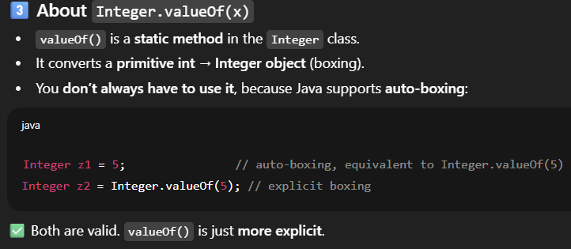

---

```java
Integer i = new Integer(11);  // Works, but **deprecated**
```

## 4. 
### 1️⃣ What a Wrapper Class Really Does  

- Wraps a primitive type in an object, so it can be treated like any other object.

- Provides extra features / methods that the primitive does not have.

- Enables usage in collections, generics, and APIs that require objects.

- Supports null values, which primitives cannot.

### 2️⃣ So yes, in simple words…

- Primitive → “bare number” → limited functionality

- Wrapper → “smart object around that number” → enhanced functionality

### 3️⃣ Static methods vs instance (object) methods

- Integer.parseInt("123") → static method

    - Can be called without creating an Integer object

    - Works directly on String → int conversion

- Integer.valueOf(5) → static method

    - Returns an Integer object from a primitive int

✅ Static methods are part of the class, not the object. So you don’t need a wrapper object to call them.

---

### 4️⃣ What the Integer object actually gives you

Once you have an Integer object, you can do things with the object itself:
```java
int x = 5;          // primitive
Integer y = 7;      // wrapper object

System.out.println(y.equals(7));       // ✅ true, works on object
System.out.println(y.compareTo(10));   // ✅ compares to another Integer
System.out.println(y.toString());      // ✅ converts this object to String
```
- These instance methods cannot be called on primitive int because it’s not an object.

- ***`int has no methods at all`***.

| Feature          | Primitive int                | Integer object                                          |
| ---------------- | ---------------------------- | ------------------------------------------------------- |
| Null value       | ❌ cannot be null             | ✅ can be null                                           |
| Collections      | ❌ cannot be used in generics | ✅ can store in `ArrayList<Integer>` etc.                |
| Instance methods | ❌ none                       | ✅ `compareTo()`, `equals()`, `toString()`, `hashCode()` |
| Object identity  | ❌ no reference               | ✅ can use `==` for reference, `equals()` for value      |
| Polymorphism     | ❌ cannot be passed as Object | ✅ can be passed to methods expecting Object             |


## 5.
Perfect 👌 now we’re at the core conversion part — how to go back and forth between int and Integer. Let’s do both autoboxing/unboxing and explicit methods.   

### 1️⃣ int → Integer (Boxing)  
✅ Autoboxing (automatic)  
```java
int x = 5;
Integer y = x;   // compiler does Integer.valueOf(x) internally
System.out.println(y);  // 5

✅ Explicit
```java
int x = 5;
Integer y = Integer.valueOf(x);  // preferred explicit way
System.out.println(y);  // 5
```

### 2️⃣ Integer → int (Unboxing)
✅ Auto-unboxing (automatic)  
```java
Integer z = 10;
int a = z;   // compiler does z.intValue() internally
System.out.println(a);  // 10
```
✅ Explicit   
```java
Integer z = 10;
int a = z.intValue();   // manually unbox
System.out.println(a);  // 10
```

### 3️⃣ Full Demo

```java
public class WrapperDemo {
    public static void main(String[] args) {
        // int → Integer
        int x = 5;

        Integer y1 = x;                   // Autoboxing
        Integer y2 = Integer.valueOf(x);  // Explicit

        System.out.println("y1: " + y1);
        System.out.println("y2: " + y2);

        // Integer → int
        Integer z = 20;

        int a1 = z;              // Auto-unboxing
        int a2 = z.intValue();   // Explicit

        System.out.println("a1: " + a1);
        System.out.println("a2: " + a2);
    }
}
```

✅ Summary 
| Conversion    | Autoboxing/Unboxing | Explicit                          |
| ------------- | ------------------- | --------------------------------- |
| int → Integer | `Integer y = x;`    | `Integer y = Integer.valueOf(x);` |
| Integer → int | `int a = z;`        | `int a = z.intValue();`           |


```java
	//little wrapper demo
    int x = 5;
    System.out.println(x);
    
    Integer z = 7;
    //observe that there are several functions provided when u do (z.), but u cant do that with primitive x 
    System.out.println(z.toString()+7);
    System.out.println(z.intValue()+7);

    // you can change the z into a textNumber, but u cant do that to x. 
    //Therfore Wrapper is required.

```
</details>


# ⚡Next