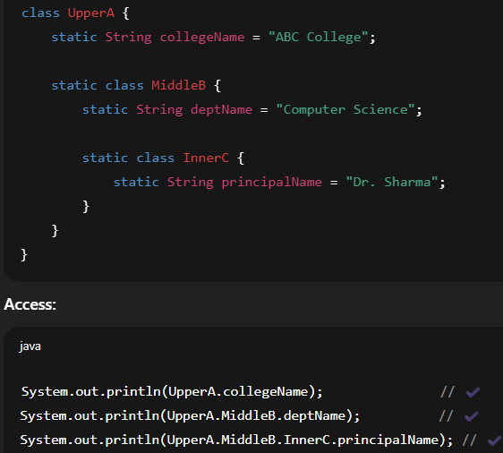

### mar30 
- `shift + right` click to open menu to select terminal  
- environmental variables , from bin folder 
- in eclipse `ctrl+alt+T` opens a terminal


### apr13
-  Why can’t you declare a method inside main() in Java?
    - Java is a statically-typed, block-structured, class-based language.
    - Methods are members of a class — not of other methods.
    - A method definition must exist at the class level, not nested inside another method. 

            void sayHello() {
                System.out.println("Hello!");
            }

    - defining a method.👆
    - But in Java:   
      You can call methods inside methods.  
     ` You cannot declare methods inside methods — because Java's syntax and memory model are not designed to handle nested method scopes.`

     - if you try it, u would get `error: illegal start of expression`
- Why?  
    - Because the Java compiler only expects statements (like int x = 5;, sayHello();, if(...) {...} etc.) inside a method.  
    - A method definition is not a statement — it belongs to the class body, not inside a method body.

    -correct apporoach  
     
        public class Main {
            public static void main(String[] args) {
                sayHello();
            }

            static void sayHello() {
                System.out.println("Hello!");
            }
        }

- 
    What you wanted	Java equivalent   
    Method inside main--------------------- ❌ Not allowed  
    Anonymous class inside main------------ ✅ Yes  
    Lambda inside main (Java 8+)----------- ✅ Yes
---
- ⚙️ But other languages allow this…  
    Yes!  
    Languages like Python and JavaScript allow function definitions inside functions because:  

    Their runtime environments are more dynamic.  

    Functions are first-class citizens (they can be created, passed, and returned like any other value).

    Their scoping and memory models are built to support this.
    
    📝  

        def main():
            def say_hello():
                print("Hello!")
            say_hello()
        
        main()
---


### ⚡apr14

✅ What is Method Overloading?  
Method Overloading ek aisa feature hai jisme ek hi naam ke multiple methods banaye jaate hain, lekin:  

- Unke parameters ka number alag hota hai

- Ya parameters ka type alag hota hai

- Ya dono alag hote hain  

   → Same method name, different method signatures.  
---

✅ Rules of Method Overloading
Method ka naam same hoga

- Parameters alag honge

- Number of parameters alag

- Ya type alag

- Ya dono alag

- Return type ka koi lena dena nahi hota    

📌 Return type change karne se method overloading nahi hoti
Agar sirf return type badla, to error aayega  

- Java compile time pe decide karta hai ki kaunsa method call hoga — isliye isse Compile-time Polymorphism bhi bolte hain.

---

✅ Practical Real-World Use Cases  
Situation -----------------------------Method Overloading Example  
Calculator app----------------------- add(int, int), add(double, double), add(int, int, int)  
Logging or Message formatting-----log(String msg), log(String msg, int errorCode)    
Banking application------------------(withdraw)	withdraw(int amount), withdraw(double amount)  
Drawing shapes----------------------draw(int radius), draw(int length, int breadth)  
File saving ---------------------------save(String path), save(String path, boolean overwrite)  

---


### ⚡apr20

#### I encounter some issue in running the access modifier code, have a proper folder structure for packages and make sure to complie eveything using wildcard.  
- ` javac building1\*.java building2\*.java`
    - declare package building1;
    - declare package building2;
    - then complie eveything , in order to work properly


---


---


---


---


---
### After learning md , now observe the note quality
--- 

<details><summary> Static Class,still object making </summary> 

```java
    package basicConcepts;

    public class StringDatatype {   

    // Nested class Pupil inside StringDatatype
    static class Pupil {
        String name;
        int std;
        String result;

        // Constructor
        Pupil(String name, int std, String result) {
            this.name = name;
            this.std = std;
            this.result = result;
        }
    }

     public static void main(String[] args) {
        // Create an object of Pupil
        Pupil p1 = new Pupil("Prakash", 10, "Pass");
        
        // Print details
        System.out.println("Name: " + p1.name);
        System.out.println("Standard: " + p1.std);
        System.out.println("Result: " + p1.result);
    }
}

```
1. 
---

<div align="center"></div>

2. 
---

<div align="center"></div>

3.   
---

<div align="center"></div>

### More on Static
✅ static hota kya hai? - 
“Yeh cheez class ke saath judi hai, object ke saath nahi.”

🔵 1️⃣ Jab koi cheez static hoti hai:

- Usko class name se hi access kar sakte ho.

- Object banane ki zarurat nahi hoti.(variables and method ke case mei)
- But agr class Static hai , eska mtlb obivously vo kis top class ke ander hogi , isley 
    - outer object tou banana hi padyga top class ka.

observe
```java
class A {
  static int num = 10;    // static field
  static void show() {    // static method
    System.out.println("Hello");
  }
}

// Access:
A.num;         // ✅
A.show();      // ✅

A a = new A();
a.show();      // ❌ bad practice, but works

```

---
🔵 2️⃣ Agar static nahi hai:  
- Toh woh instance (object) se related hai.

- Usko access karne ke liye object banana zaruri hai.

Example:
```java
class A {
  int num = 5;           // instance field
  void show() {          // instance method
    System.out.println("Hi");
  }
}

// Access:
A.show();   // ❌ Error

A a = new A();
a.show();   // ✅ Works

```
---
<br>
<br>
<div align="center"></div>

4. 
example:
<details><summary>full demo</summary>

```java

    class Example {
    static int count = 0; // static variable

    int id;               // instance variable

    Example(int id) {
        this.id = id;
        count++;            // static value sab objects me same
    }

    static void staticMethod() {
        System.out.println("Static method");
    }

    void instanceMethod() {
        System.out.println("Instance method");
    }

    static class Nested {
        void show() {
        System.out.println("Static nested class");
        }
    }
    }

    public class Main {
    public static void main(String[] args) {
        Example.staticMethod();         // ✅

        Example e1 = new Example(101);
        Example e2 = new Example(102);

        System.out.println(Example.count); // ✅

        Example.Nested n = new Example.Nested();
        n.show();                        // ✅
    }
    }

```
</details>

<div align="center"></div>
<div align="center"></div>

## moreStatic again  

✅ 1️⃣ static ka matlab kya?
static ka matlab:

- Yeh cheez class ke sath jud gayi, object ke sath nahi.

- Jab koi cheez static hoti hai, toh uske liye har object me alag copy nahi banegi, bas ek hi copy hogi jo class ke level par hoti hai.

✅ 2️⃣ static ka fayda kya hai?  
- Agar tumhe aise data ya method chahiye jo sab objects me same ho, toh static banao.

- Isse memory save hoti hai, aur common info ko maintain karna easy ho jata hai.

✅ 3️⃣ Real example
🔹 Example: College Students   
Socho tum ek College bana rahe ho:  

- Har student ka naam, roll number alag hoga → object level data.

- Sab students ka College name same hoga → class level data.

<div align="center"></div>

---
5. 
<br> 

```java
Student.collegeName = "XYZ College";

Student s1 = new Student();
s1.name = "Ram";
s1.roll = 1;

Student s2 = new Student();
s2.name = "Shyam";
s2.roll = 2;

System.out.println(s1.collegeName);  // XYZ College
System.out.println(s2.collegeName);  // XYZ College

```


6. 
✅ Phir s1.collegeName allowed kyun hai?  
- Java ko tumhe flexibility deni hoti hai, isliye woh syntax allow karti hai.

- Lekin yeh good practice nahi hai, kyunki:    

   - collegeName object se related nahi hai, woh sab objects me common hai.

   - Tumhe clearly dikhana chahiye ki yeh variable class level ka hai, object level ka nahi.

7. 
✅ Real warning
Agar tum s1.collegeName likhoge, toh beginners ko lag sakta hai ki:  
>"Oh! Shayad har object ka collegeName alag hai!"   
But woh galat hoga — sabka collegeName same hai.

```java
System.out.println(Student.collegeName); ✅ Clear
System.out.println(s1.collegeName); ❌ Confusing but works

```
8. 
✅ Ek twist
Agar tum s1.collegeName = "ABC"; likh doge:  
- Toh Java collegeName ki value class level pe hi change karega.  
- s2.collegeName bhi ABC ho jayega.
- Toh s1.collegeName se change karna allowed hai, lekin woh change sab pe apply hoga.

---

9. 
<details><summary>Real world Example</summary>

```java
class BankAccount {
    String accountHolder;
    double balance;
    static double interestRate = 5.0;  // same for all accounts

    BankAccount(String accountHolder, double balance) {
        this.accountHolder = accountHolder;
        this.balance = balance;
    }

    void displayAccountInfo() {
        System.out.println("Account Holder: " + accountHolder);
        System.out.println("Balance: " + balance);
        System.out.println("Interest Rate: " + interestRate + "%");
    }

    static void changeInterestRate(double newRate) {
        interestRate = newRate;
    }
}

public class Main {
    public static void main(String[] args) {
        BankAccount acc1 = new BankAccount("Ram", 10000);
        BankAccount acc2 = new BankAccount("Shyam", 20000);

        acc1.displayAccountInfo();
        acc2.displayAccountInfo();

        // Bank changes interest rate for everyone
        BankAccount.changeInterestRate(6.5);

        System.out.println("\nAfter changing interest rate:\n");

        acc1.displayAccountInfo();
        acc2.displayAccountInfo();
    }
}

Account Holder: Ram
Balance: 10000.0
Interest Rate: 5.0%

Account Holder: Shyam
Balance: 20000.0
Interest Rate: 5.0%

After changing interest rate:

Account Holder: Ram
Balance: 10000.0
Interest Rate: 6.5%

Account Holder: Shyam
Balance: 20000.0
Interest Rate: 6.5%


```
</details>

---
10. Static Continued
<details>

-  static word sunke lagta hai fixed, rukaa hua, badalne nahi wala — par Java mein woh badal bhi sakta hai!Toh iska naam static kyun hai? Chalo clear karte hain 👇

✅ 1️⃣ Static word ka asal matlab  
Java mein static ka matlab “class ke saath fixed” hota hai — object ke saath nahi.    

- static ka matlab “class level par fix ho gaya” — iska koi object ke saath link nahi hai.

- Isliye:

    - Har object alag se copy nahi banayega.

    - Ek hi copy sab share karenge.

    - Isliye memory static hoti hai — woh class loading time pe reserve ho jati hai.
    - `meomry address is constan tbut value can be changed.`

✅ 2️⃣ Static ka real meaning: “memory location fixed”
Socho:  
- Jab class load hoti hai (class Student), tab hi static cheez ke liye memory reserve ho jati hai.

- Jab tak class loaded hai, woh value available hai — bina kisi object ke.

- Isliye static ka matlab: class ke sath fix, runtime me fixed, par value change ho sakti hai.

```java 

```
</details>


---
11. 
<details>

```java
class User {
    static int totalUsers = 0; // Class load pe ek baar hi 0 hoga

    String name;

    User(String name) {
        this.name = name;
        totalUsers++;  // Har object banne pe badhega
        System.out.println("New user created: " + name);
        System.out.println("Current total users: " + totalUsers);
    }
}

public class Main {
    public static void main(String[] args) {
        System.out.println("Starting program...");

        System.out.println("Current total users BEFORE any user: " + User.totalUsers);

        User u1 = new User("Ram");
        User u2 = new User("Shyam");
        User u3 = new User("Mohan");

        System.out.println("Current total users AFTER all users: " + User.totalUsers);
    }
}
```
</details>
---

12.  
<details>
🔍 Tera point kya hai?
Tu keh raha hai:

>Agar User class mein static int totalUsers = 0; hai
aur User u1 = new User(); likha,
toh kya totalUsers dobara 0 nahi ho jana chahiye?

Matlab:  
- Har new User() pe class dubara chalegi kya?  
- Kya static int totalUsers = 0; har object ke saath fir se execute hoga?

✅ Jawab: Bilkul nahi hoga!  
Java mein class ek hi baar load hoti hai — JVM ke andar!  
- Jab tumhara User class pehli baar use hota hai (chahe new se ya static member access se), tab JVM:  

    - static int totalUsers = 0; ek hi baar run karta hai.  
    - totalUsers ke liye memory reserve ho jaati hai → Method Area mein.  

- Uske baad jitni baar bhi new User() likhoge:  
    - Bas constructor run hota hai, static part dobara nahi.  
</details>  

---

13. Stick with hyphens (-) as you are already using them. They are more SEO-friendly and widely used in web projects.
---

14. ### 👉Now observe that how the Syntax for making the instance/object changes in case of a nested static class.
---

>I hope till now we have under stood that "why static" 
> - static class se related hota hai , object se nahi 
> - static members ko bina object banaye, sirf class naam se access kar sakte ho.
> - static member ki memory fixed hoti hai value nahi , we change its value again and again.
> - static(fixed) yet flexible.

**♦️🚩Now here is the catch**  
 - even though static members ke leye object nahi banane hoty ,but 
 - if a class is nested and also it is static , in that case in order to use that static-class we have to make an object of outer/top class 
 
**`Top-level classes (the ones you write directly in a .java file) — can’t be static. they are always "public class AnyName" `**

```java
// ✅ Valid: Top-level
public class Outer {
    static class StaticInner { }  // OK
    class Inner { }               // Also OK
}

// ❌ Invalid: Top-level
static class Standalone { } // Compile error!

```

🔥See here 
- a class can have a another class inside it (nested)
    - a non static
    - a static

####  bhai saaf saaf baat hai, whether the inner class is static or non static , dono case mei outer/top class ka instance/object banyga 

<!--   -->
<!--  -->
<!--  -->


👉 Java ka rule hai:

>Non-static inner class ka object kabhi bhi independent nahi ban sakta.  
Uske paas Outer ka instance hona chahiye.


♦️Click to see a detailed exampleand guide
<details>

```java
public class Company {
    String companyName = "TechCorp";

    // Static Nested Class
    static class Department {
        String deptName;

        Department(String deptName) {
            this.deptName = deptName;
        }

        void showDept() {
            System.out.println("Department Name: " + deptName);
        }
    }

    // Non-Static Inner Class
    class Employee {
        String empName;

        Employee(String empName) {
            this.empName = empName;
        }

        void showEmployee() {
            System.out.println("Employee Name: " + empName);
            System.out.println("Works at: " + companyName);
        }
    }

    public static void main(String[] args) {
        System.out.println("=== Static Nested Classes ===");

        // ✅ Create multiple Departments
        Company.Department dept1 = new Company.Department("Engineering");
        Company.Department dept2 = new Company.Department("Marketing");

        dept1.showDept();
        dept2.showDept();

        System.out.println("\n=== Non-Static Inner Classes ===");

        // ✅ Create 1 Company instance
        Company myCompany = new Company();

        // ✅ Create multiple Employees under same Company
        Company.Employee emp1 = myCompany.new Employee("Prakash");
        Company.Employee emp2 = myCompany.new Employee("Sara");
        Company.Employee emp3 = myCompany.new Employee("Ravi");

        emp1.showEmployee();
        emp2.showEmployee();
        emp3.showEmployee();
    }
}

//output 

=== Static Nested Classes ===
Department Name: Engineering
Department Name: Marketing

=== Non-Static Inner Classes ===
Employee Name: Prakash
Works at: TechCorp
Employee Name: Sara
Works at: TechCorp
Employee Name: Ravi
Works at: TechCorp
```

✔️ 1️⃣ Static Nested Classes — multiple Departments  
- dept1 and dept2 don’t need any Company object.  
- They’re completely separate.  
- Example: Multiple Departments can exist even without creating a Company instance.

✔️ 2️⃣ Non-Static Inner Classes — multiple Employees  
- Only one Company object (myCompany) is created.  
- All Employee objects are tied to that one Company instance.  
- So all Employee objects can access companyName. 

---
emp mei constructor ke through dept ko send karo 


```java
public class Company {
    String companyName = "TechCorp";

    // Static Nested Class
    static class Department {
        String deptName;

        Department(String deptName) {
            this.deptName = deptName;
        }

        void showDept() {
            System.out.println("Department Name: " + deptName);
        }
    }

    // Non-Static Inner Class
    class Employee {
        String empName;
        Department dept;  // link to department

        Employee(String empName, Department dept) {
            this.empName = empName;
            this.dept = dept;
        }

        void showEmployee() {
            System.out.println("Employee Name: " + empName);
            System.out.println("Department: " + dept.deptName);
            System.out.println("Works at: " + companyName);
        }
    }

    public static void main(String[] args) {
        // Static nested class objects — Departments
        Department eng = new Department("Engineering");
        Department mkt = new Department("Marketing");

        eng.showDept();
        mkt.showDept();

        // Non-static inner class objects — Employees
        Company myCompany = new Company();

        Company.Employee emp1 = myCompany.new Employee("Prakash", eng);
        Company.Employee emp2 = myCompany.new Employee("Sara", mkt);
        Company.Employee emp3 = myCompany.new Employee("Ravi", eng);

        emp1.showEmployee();
        emp2.showEmployee();
        emp3.showEmployee();
    }
}
```


</details>
</details>
<br>

# 🔥Method Chaining 🔗🔗🔗

This design or way of writing a function is helpful when you are making a object with lot of parametrs and they can get confusing .Also in the process u might miss the sequence of passing a parameter, and may encounter a error.

Method Chaining is most evident in Builer pattern/method.

<details><summary>Click 4 moreDetails</summary>

### 1. Three Versions 
    
1. Constructor-only
    - sari values object banaty time hi deni hoti hai , correct sequence mei
    - code mei setMethods nahi hai , no return values
    - method-chaining nahi hogi ❌❌

```java
public class Player {
    private String name;
    private int age;
    private String gender;
    private String weapon;
    private String unit;
    private String service;
    private int score;

    // Constructor Only
    public Player(String name, int age, String gender, String weapon, String unit, String service, int score) {
        this.name = name;
        this.age = age;
        this.gender = gender;
        this.weapon = weapon;
        this.unit = unit;
        this.service = service;
        this.score = score;
    }

    public void printSummary() {
        System.out.println("Player: " + name + " (" + gender + ", " + age + ")");
        System.out.println("Unit: " + unit + ", Service: " + service);
        System.out.println("Weapon: " + weapon + ", Score: " + score);
    }
}

Player p = new Player("Praka",29,"male"...)
```

2. Method-Chainig (No explicit construcutr written)
```java
public class Player {
    private String name;
    private int age;
    private String gender;
    private String weapon;
    private String unit;
    private String service;
    private int score;

    // Default constructor
    public Player() {}

    public Player setName(String name) {
        this.name = name;
        return this;
    }

    public Player setAge(int age) {
        this.age = age;
        return this;
    }

    public Player setGender(String gender) {
        this.gender = gender;
        return this;
    }

    public Player setWeapon(String weapon) {
        this.weapon = weapon;
        return this;
    }

    public Player setUnit(String unit) {
        this.unit = unit;
        return this;
    }

    public Player setService(String service) {
        this.service = service;
        return this;
    }

    public Player setScore(int score) {
        this.score = score;
        return this;
    }

    public Player printSummary() {
        System.out.println("Player: " + name + " (" + gender + ", " + age + ")");
        System.out.println("Unit: " + unit + ", Service: " + service);
        System.out.println("Weapon: " + weapon + ", Score: " + score);
        return this;
    }
}

new Player()
    .setName("Arjun")
    .setAge(25)
    .setGender("Male")
    .setWeapon("Sniper")
    .setUnit("Alpha")
    .setService("Stealth Ops")
    .setScore(8700)
    .printSummary();
```
3. Constructor + MethodChaining(Best of both)
```java
public class Player {
    private String name;
    private int age;
    private String gender;
    private String weapon;
    private String unit;
    private String service;
    private int score;

    // Full constructor
    public Player(String name, int age, String gender, String weapon, String unit, String service, int score) {
        this.name = name;
        this.age = age;
        this.gender = gender;
        this.weapon = weapon;
        this.unit = unit;
        this.service = service;
        this.score = score;
    }

    // Default constructor (for chaining)
    public Player() {}

    public Player setName(String name) {
        this.name = name;
        return this;
    }

    public Player setAge(int age) {
        this.age = age;
        return this;
    }

    public Player setGender(String gender) {
        this.gender = gender;
        return this;
    }

    public Player setWeapon(String weapon) {
        this.weapon = weapon;
        return this;
    }

    public Player setUnit(String unit) {
        this.unit = unit;
        return this;
    }

    public Player setService(String service) {
        this.service = service;
        return this;
    }

    public Player setScore(int score) {
        this.score = score;
        return this;
    }

    public Player printSummary() {
        System.out.println("Player: " + name + " (" + gender + ", " + age + ")");
        System.out.println("Unit: " + unit + ", Service: " + service);
        System.out.println("Weapon: " + weapon + ", Score: " + score);
        return this;
    }
}

//now an instance can be createdd using either of the methods.
```
<br>
<br>
<br>


</details>
<br> 
<br> 

# ⚡Constructor Designing

>`“Beforehand we must know how many parameters we will use for an object, and accordingly design our constructor.”`

# Core of Java 

in java   
- classes are like datatype.Blueprint to make items/objects/instances.
- Suppose u have different students who have there own individual name,branch,sem.  
    - at the same time all students of a particular college will have same Collegename and Principal name 

- so make a tamplate called Student which can process/keep student parameters using constructor. Also based on the paramemters provided it can perform function(method) on it and return u a result.
- where as this template can have certian fixed value of its own which is constant(yet) changable through out.(static)
- so the data Members which are different for each memebers are called INSTANCE LEVEL VARIABLES/METHODS.
- and datamembers which are fixed in the template are called CLASS LEVEL MEMBERS. and they are called by using the class reference  `class.datamember` -->Student.Principal 
    - Student is the class and Principal is the static datamember.
    - these are made by using the keyword `static` in front of the datamemeber
    - which u think will be same for the template through out ,and hence the will be utilised by each object that is created.

>`this` points towards the instance level dataMember .   
     - we use this internally for our instance level/object level datamembers.

>recall the datatype String.  

## more Java

### Variable agar class ke andar ho


🔑 Isko JVM kahan store karti hai?  

|Type|Storage|
|:---|---:|
|Instance Variable|Heap Memory — Jab object banta hai tab allocate hota hai|
|Static Variable|Method Area / Class Area — Class load hote hi allocate ho jata hai (har object mein copy nahi hoti)|
<br>
	

✅ Default values milti hain:    
Reference: null    
Primitive: 0, 0.0, false, '\u0000' for char  

### Variable agar method ke andar ho  

 then it local variable   


🔥


|type||name|
|:---|---|--:|
|inside class - Static||Class variables|
|inside class -nonstatic||instance variables|
|inside method||local variables|

>Agar nested classes aur unke members static hain, toh `chahe kitni bhi nested classes` hoon — direct `class chain` se access ho jayega, `bina kisi object banaye`.  

⏬⏬⏬⏬⏬



